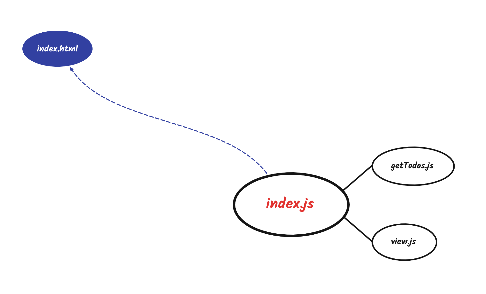
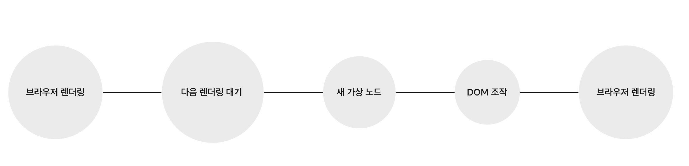
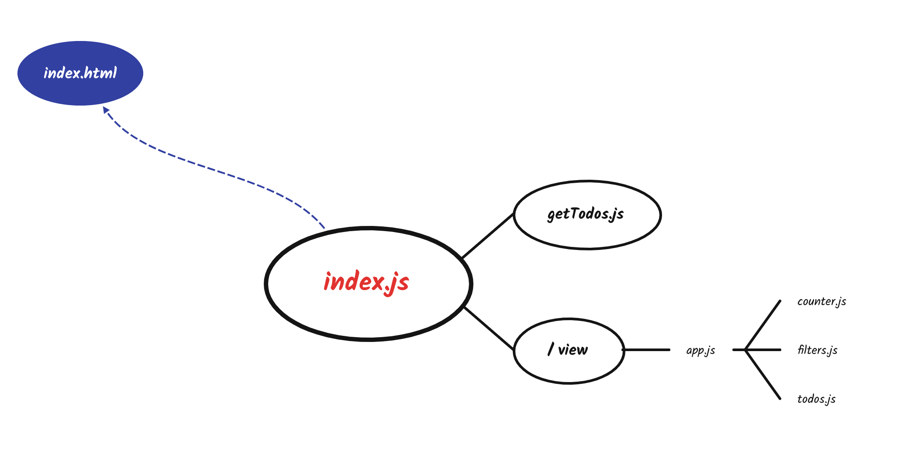

## 문서 객체 모델(DOM)

- [DOM](https://developer.mozilla.org/ko/docs/Web/API/Document_Object_Model/Introduction)은 웹 어플리케이션의 구성 요소를 조작할 수 있는 API다.
- 웹 페이지는 HTML로 정의된 트리 구조를 갖는다.
- DOM은 이를 관리하는 방법이다.

## 렌더링 성능 모니터링

책에서는 렌더링 성능을 모니터링하는 몇 가지 방법을 소개한다.

- 크롬 개발자 도구 > `Command+Shift+P` > `Show frame per seconds meter` 선택
- [stats.js](https://github.com/mrdoob/stats.js) 활용
- 커스텀 성능 위젯
    
    ```js{11-41}
    let panel; start; frames;
    
    const createPanel = () => {
      const panel = document.createElement('div');
    
      //...panel 스타일 정의 생략

      return panel;
    }
    
    const tick = () => {
      frames++;
    
      const now = window.performance.now();
    
      if (now >= start + 1000) {
        panel.innerText = frames;
        frames = 0;
        start = now;
      }
    
      window.requestAnimationFrame(tick);
    }
    
    const init = (parent = document.body) => {
      panel = createPanel();
    
      window.requestAnimationFrame(() => {
        start = window.performance.now();
        parent.appendChild(panel);
        tick();
      })
    }
    
    init();
    ```

## 렌더링 함수

순수 함수로 요소를 렌더링한다는 것은 DOM 요소가 애플리케이션의 상태에만 의존한다는 것을 의미한다.

> view = f(state)

## TODO MVC

책에서는 [ToDoMVC](https://todomvc.com/)에서 제공하는 [템플릿](https://github.com/tastejs/todomvc/blob/gh-pages/examples/vanillajs/index.html)을 활용한다. 다양한 언어, 프레임워크로 구현된 투두리스트를 제공하는 오픈소스인데 다른 언어를 처음 접할 때도 매우 유용할 것 같다.

```html{2, 10, 13, 14}
<body>
  <section class="todoapp">
    <header class="header">
      <h1>todos</h1>
      <input class="new-todo" placeholder="What needs to be done?" autofocus>
    </header>
    <section class="main">
      <input id="toggle-all" class="toggle-all" type="checkbox">
      <label for="toggle-all">Mark all as complete</label>
      <ul class="todo-list"></ul>
    </section>
    <footer class="footer">
      <span class="todo-count">1 Item Left</span>
      <ul class="filters">
        <li>
          <a href="#/">All</a>
        </li>
        <li>
          <a href="#/active">Active</a>
        </li>
        <li>
          <a href="#/completed">Completed</a>
        </li>
      </ul>
      <button class="clear-completed">Clear completed</button>
    </footer>
  </section>
  <footer class="info">
    <p>Double-click to edit a todo</p>
    <p>Created by <a href="http://twitter.com/thestrazz86">Francesco Strazzullo</a></p>
    <p>Thanks to <a href="http://todomvc.com">TodoMVC</a></p>
  </footer>
  <script type="module" src="index.js"></script>
</body>
```
`view.js`에서는 클래스 선택자로 컴포넌트에 접근한 요소의 뷰를 새로운 상태로 갱신한다.


  
`getTodos.js`는 투두리스트 데이터를 가져오는데 책에서는 [faker-js](https://github.com/faker-js/faker)를 활용하고 있다.

```js{6-9, 13-16}
// index.js

import getTodos from './getTodos.js'
import view from './view.js'

const state = {
  todos: getTodos(),
  currentFilter: 'All'
}

const main = document.querySelector('.todoapp')

window.requestAnimationFrame(() => {
  const newMain = view(main, state)
  main.replaceWith(newMain)
})
```
모든 DOM 조작이나 애니메이션은 `requestAnimation` API를 기반으로 한다. 이 API는 메인 스레드를 차단하지 않으며 다음 repaint가 이벤트 루프에서 스케쥴링되기 직전에 실행된다. 



하지만 위 코드는 두 가지 문제를 갖고 있다.

- 하나의 거대한 함수
- 동일한 작업을 수행하는 여러 메서드 - 하나의 뷰에서 `counter`, `todos`, `filter`를 다루고 있음


각 요소를 렌더링하는 뷰 함수를 나누어 책임을 분리하고 일관성 문제를 해결한다.


## 컴포넌트 함수

> 조건 1. 컴포넌트 기반의 애플리케이션을 작성하려면 컴포넌트 간에 선언적인 방식으로 상호작용 해야 한다.
> 

```html{4, 8, 11}
<body>
  <section class="todoapp">
      <!-- // ... -->
          <ul class="todo-list" data-component="todos">
          </ul>
      </section>
      <footer class="footer">
          <span class="todo-count" data-component="counter">
            1 Item Left
          </span>
          <ul class="filters" data-component="filters">
              <li>
                  <a href="#/">All</a>
              </li>
              <li>
                  <a href="#/active">Active</a>
              </li>
              <li>
                  <a href="#/completed">Completed</a>
              </li>
          </ul>
          <!-- // ... -->
      </footer>
  </section>
</body>
```
구성 요소의 이름을 `data-component` 속성에 넣는다.

```js
// registry.js

const createElement = renderer => {
  return (target, state, events) => {
    const element = renderer(target, state, events)

    const children = element
      .querySelectorAll('[data-component]')

    Array
      .from(children)
      .forEach(child => {
        const componentName = child.dataset.component

        const renderer = registry[componentName]

        if (!renderer) {
          return
        }

        child.replaceWith(renderer(child, state, events))
      })

    return element
  }
}
```
각 요소의 `dataset` 속성으로 접근할 수 있다. 이는 뷰 함수에서 필수적으로 각 요소를 호출하던 코드를 대체한다.

> 조건 2. 컴포넌트 라이브러리를 위한 또 다른 필수 조건은 레지스트리로, 레지스트리는 앱에서 사용할 수 있는 모든 컴포넌트의 인덱스이다.
> 

레지스트리의 키는 `data-component` 속성 값과 일치한다.

```js
const registry = {
	'todos': todoRenderer,
	'counter': counterRenderer,
	'filters': filterRenderer
}
```

이 메커니즘은 루트 컨테이너 뿐만 아니라 앞으로 생성할 모든 컴포넌트에도 적용한다. 이렇게 하면 모든 컴포넌트를 다른 컴포넌트 안에서도 사용할 수 있다. 재사용성은 컴포넌트 기반 앱의 핵심이다.

대략적인 순서는 아래와 같다.

- 레지스트리에 뷰 컴포넌트 등록
- `root`의 `children` 중 레지스트리에 등록된 요소가 있다면 이를 갱신하는 뷰 함수 실행
- 모든 `children`을 순회하고 최종적으로 갱신된 새로운 `root`를 기존 `root`에 대체

## 데이터 렌더링

동적 데이터를 렌더링 하는 간단한 예시

```js
// index.js

// ...생략

const render = () => {
  window.requestAnimationFrame(() => {
    const main = document.querySelector('.todoapp')
    const newMain = registry.renderRoot(main, state)
    main.replaceWith(newMain)
  })
}

window.setInterval(() => {
  state.todos = getTodos()
  render()
}, 5000)

render()
```

5초마다 새로운 상태가 바인딩된 가상 루트를 실제 루트와 교체한다. 이러한 방식은 작은 앱이라면 충분한 성능을 발휘하지만 대규모 프로젝트에선 성능을 저하시킬 수 있다.

## 가상 DOM

가상 DOM의 핵심은 `diff` 알고리즘이다. 첫 방식에서는 전체 `ul`을 교체했지만 가상 DOM을 사용하면 시스템은 새롭게 추가된 요소가 실제 DOM에 필요한 유일한 작업이라는 사실을 동적으로 이해할 수 있다. 


메인 컨트롤러에서 `replaceWith` 대신 사용할 아주 간단한 `diff` 알고리즘을 작성한다.

```js
// index.js

const render = () => {
  window.requestAnimationFrame(() => {
    const app = document.querySelector('.todoapp')
    const newApp = registry.createRoot(app, state)
    renderDiff(document.body, app, newApp)
  })
}
```

`renderDiff`는 부모 노드, 실제 노드, 가상 노드를 인자로 받아 재귀적으로 실행되는 함수다.

실제 노드는 존재하지만 가상 노드는 없다면 삭제 대상이므로  
(상태는 가상 노드 기준으로 갱신되는 것을 유념하자.)
```js
// renderDiff.js

if (realNode && !virtualNode) {
    realNode.remove();
    return;
}
```

반대로 실제 노드는 없지만 가상 노드가 있다면 추가 대상이므로

```js
// renderDiff.js

if (!realNode && virtualNode) {
    parentNode.appendChild(virtualNode);
    return;
}
```

두 노드가 모두 있는 경우에 비교를 해서 변경된 경우에만 실제 노드를 대체한다.

```js
// renderDiff.js

if (isNodeChanged(virtualNode, realNode)) {
    realNode.replaceWith(virtualNode);
    return;
}
```

노드를 비교할 때는 아래 사항들을 확인한다.
- `attribute` 갯수가 다른가?
- 하나 이상의 `attribute`가 변경되었는가?
- 노드에 자식이 없다면 노드의 `textContent`가 다른가?

## 출처
_프란세스코 스트라츨로, [『프레임워크 없는 프론트엔드 개발』](https://search.shopping.naver.com/book/search?bookTabType=ALL&pageIndex=1&pageSize=40&query=%ED%94%84%EB%A0%88%EC%9E%84%EC%9B%8C%ED%81%AC%20%EC%97%86%EB%8A%94%20%ED%94%84%EB%A1%A0%ED%8A%B8%EC%97%94%EB%93%9C%20%EA%B0%9C%EB%B0%9C&sort=REL), 에이콘 출판(2021.01.21.)_