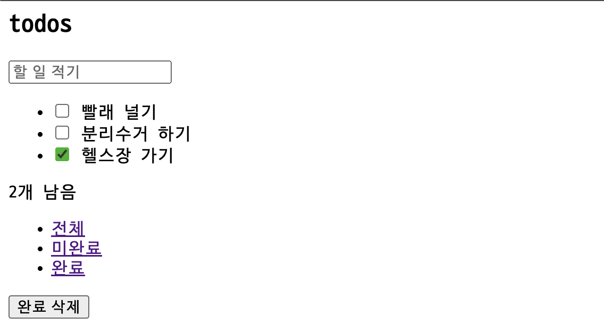
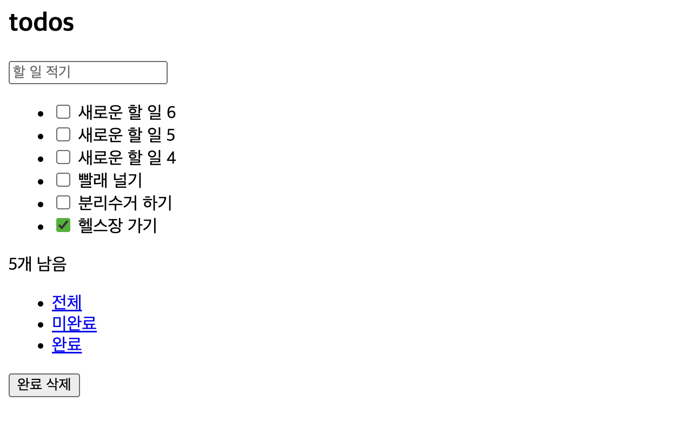

## 문서 객체 모델(DOM)

돔은 웹 어플리케이션을 구성하는 요소를 조작할 수 있는 API다. 웹 페이지는 HTML로 정의된 트리 구조를 갖는다. 돔은 이를 관리하는 방법이다.

<br />

## 렌더링 성능 모니터링

웹용 렌더링 엔진을 설계할 때는 가독성과 유지보수성을 염두해야 한다.

- 크롬 개발자 도구 - Show frame per seconds meter 메뉴 선택
- [stat.js](https://github.com/Kevnz/stats.js) 라이브러리 활용하기
- 커스텀 성능 위젯   
```js{13-35}
let panel;
let start;
let frames;

const create = () => {
  const div = document.createElement('div');

  // create panel wrapper

  return div;
}

const tick = () => {
  frames++;

  const now = window.performance.now();

  if (now >= start + 1000) {
    panel.innerText = frames;
    frames = 0;
    start = now;
  }

  window.requestAnimationFrame(tick);
}

const init = (parent = document.body) => {
  panel = create();

  window.requestAnimationFrame(() => {
    start = window.performance.now();
    parent.appendChild(panel);
    tick();
  })
}

init();
  ```

<br />

## 렌더링 함수

순수 함수로 요소를 렌더링한다는 것은 돔 요소가 애플리케이션의 상태에만 의존한다는 것을 의미한다.


> view = f(state)

<br />

## 컴포넌트 기반 애플리케이션

### 렌더링 함수

이 챕터에 나온 것처럼 투두리스트를 만들어 보았다. 나는 [ToDoMVC](https://todomvc.com/)를 사용하지 않고 좀 더 작은 뷰를 만들었다. 

접근이 필요한 요소에는 클래스 속성을 부여한다.

```html{12, 14, 16}
<html>
  <head>
    <title>todos</title>
  </head>
  <body>
    <section class="todoapp">
      <header>
        <h1>todos</h1>
        <input class="new-todo" placeholder="할 일 적기" autofocus>
      </header>
      <section class="main">
        <ul class="todo-list"></ul>
      </section>
      <footer class="footer">
        <span class="todo-count"></span>
        <ul class="filters">
          <li><a href="#/">전체</a></li>
          <li><a href="#/active">미완료</a></li>
          <li><a href="#/completed">완료</a></li>
        </ul>
        <button class="clear-completed">완료 삭제</button>
      </footer>
    </section>
    <script type="module" src="index.js"></script>
  </body>
</html>
```

저자는 [faker-js](https://github.com/faker-js/faker)를 사용하지만 간단한 예제를 위해 서버에서 받는 데이터를 단순 가정했다.

```js
const mockTodos = [
  {
    id: '1',
    text: '빨래 널기',
    completed: false,
  },
  {
    id: '2',
    text: '분리수거 하기',
    completed: false,
  },
  {
    id: '3',
    text: '헬스장 가기',
    completed: true,
  }
]
```

`fetchTodos()`는 할 일 목록을 받아오는 API 호출 함수라고 가정하자.

```js
const fetchTodos = () => mockTodos;

const state = {
  todos: fetchTodos(),
  filter: 'All'
}
```

렌더링 함수는 `appView()`를 통해 기존의 뷰를 새로운 뷰로 대체한다. 후술할 `appView()`는 이전 요소와 현재 상태를 받아 갱신된 요소를 생성한다. 렌더링 함수는 `requestAnimationFrame()`를 사용한다.

```js
const app = document.querySelector('.todoapp');

window.requestAnimationFrame(() => {
  const newApp = appView(app, state)
  app.replaceWith(newApp)
})
```

- [replaceWith()](https://developer.mozilla.org/en-US/docs/Web/API/Element/replaceWith):  이 메서드는 어떤 요소를 새로운 요소로 대체한다.
- [requestAnimationFrame()](https://developer.mozilla.org/ko/docs/Web/API/Window/requestAnimationFrame): 이 메서드는 브라우저에게 실행되기 원하는 함수를 알리고, 함수는 다음 리페인트가 이벤트 루프에 스케쥴링되기 직전에 실행된다. 메인 스레드를 차단하지 않고 브라우저 렌더링 성능에 최적화된 함수 호출이 가능하다.


`appView()`는 갱신된 요소를 리턴한다. `targetElement`의 `list`, `counter`, `filters`를 갱신하고 모든 내용을 대체한다.

```js
const appView = (targetElement, { todos, filter: currentFilter }) => {
  const element = targetElement.cloneNode(true)

  // get elements
  const list = element.querySelector('.todo-list')
  const counter = element.querySelector('.todo-count')
  const filters = element.querySelector('.filters')

  // new list
  const newList = list.cloneNode(true);

  newList.innerHTML = todos.map(({ text, completed }) => {
    return `
      <li ${completed ? 'class="completed"' : ''}>
        <div class="view">
          <input 
            ${completed ? 'checked' : ''}
            class="toggle" 
            type="checkbox">
          <label>${text}</label>
        </div>
      </li>
    `
  }).join('');

  // new counter
  const newCounter = counter.cloneNode(true);

  const howManyLeft = todos.filter(todo => !todo.completed).length;

  newCounter.textContent = `${howManyLeft}개 남음`;

  // new filters
  const newfilters = filters.cloneNode(true);
  const filterList = newfilters.querySelectorAll('li a');

  [...filterList].forEach(filter => {
    if (filter.textContent === currentFilter) {
      filter.classList.add('selected');
    } else {
      filter.classList.remove('selected');
    }
  });

  // replace elements
  list.replaceWith(newList);
  counter.replaceWith(newCounter);
  filters.replaceWith(newfilters);

  return element
}
```

브라우저에서 상태에 맞게 렌더링된 할 일 목록을 볼 수 있다.



### 중간 리팩토링

기능은 아직이지만 기본적인 모양은 완성됐다. 하지만 코드에서 리팩토링 신호를 포착할 수 있다. 일단 뷰 함수가 너무 거대하기 때문에 읽기 어렵다. 갱신할 뷰가 추가되면 코드가 더 복잡해지는 건 분명해 보인다. 게다가 각 요소(`todos`, `counter`, `filters`)를 새로운 것으로 대체하는, 내부 로직은 다르지만 같은 유형의 작업을 수행하고 있다. 하나의 책임을 갖는 함수들로 분리하면 좋을 것 같다.

예를 들어 뷰 함수는 `targetElement`와 `state`를 받아 새로운 요소를 반환한다.

```js
const viewFunction = (targetElement, state) => newElement;
```

아래 모양의 뷰 함수들로 분리했다.

```js
const counterView = (targetElement, { todos }) => {
  const newCounter = targetElement.cloneNode(true);

  const howManyLeft = todos.filter(todo => !todo.completed).length;

  newCounter.textContent = `${howManyLeft}개 남음`;

  return newCounter;
}

const filterView = (targetElement, { filter: currentFilter }) => {
  const newFilters = targetElement.cloneNode(true);
  const filterList = newCounter.querySelectorAll('li a');

  [...filterList].forEach(filter => {
    if (filter.textContent === currentFilter) {
      filter.classList.add('selected');
    } else {
      filter.classList.remove('selected');
    }
  })

  return newFilters;
}

const todosView = (targetElement, { todos }) => {
  const newTodoList = targetElement.cloneNode(true);

  newTodoList.innerHTML = todos.map(({ text, completed }) => {
    return `
      <li ${completed ? 'class="completed"' : ''}>
        <div class="view">
          <input 
            ${completed ? 'checked' : ''}
            class="toggle" 
            type="checkbox">
          <label>${text}</label>
        </div>
      </li>
    `
  }).join('');

  return newTodoList
}

const appView = (targetElement, state) => {
  const element = targetElement.cloneNode(true)

  const list = element.querySelector('.todo-list')
  const counter = element.querySelector('.todo-count')
  const filters = element.querySelector('.filters')

  list.replaceWith(todosView(list, state))
  counter.replaceWith(counterView(counter, state))
  filters.replaceWith(filterView(filters, state))

  return element
}
```

소스 코드의 디렉토리, 파일만 잘 구분해도 설계는 확연히 좋아질 수 있다. 관심사에 따라 디렉토리도 나눈다면 더 이해하기 쉬운 구조가 된다. 지금까지 작성된 코드가 이 책에서 작성하는 컴포넌트 라이브러리의 초안이다.

```bash
root
├── views
│   ├── counterView.js
│   ├── FilterView.js
│   └── TodosView.js
│   └── Appview.js
├── index.html
└── index.js
```

### 컴포넌트 함수

> 컴포넌트 기반의 애플리케이션을 작성하려면 컴포넌트 간에 선언적인 방식으로 상호작용 해야 한다.

기존 `appView()`는 함수는 갱신이 필요한 뷰 함수를 직접 호출하고 있다. 이는 선언적 방식이 아니다.

```js
const appView = (targetElement, state) => {
  const element = targetElement.cloneNode(true)

  const list = element.querySelector('.todo-list')
  const counter = element.querySelector('.todo-count')
  const filters = element.querySelector('.filters')

  list.replaceWith(todosView(list, state))
  counter.replaceWith(counterView(counter, state))
  filters.replaceWith(filterView(filters, state))

  return element
}
```

기존에 사용하던 `class` 대신 `data-component` 속성에 컴포넌트의 이름을 넣는다. 이제부터 뷰에서는 [데이터 속성](https://developer.mozilla.org/ko/docs/Learn/HTML/Howto/Use_data_attributes)을 사용한다.

```html{12, 15, 16}
<html>
  <head>
    <title>todos</title>
  </head>
  <body>
    <section class="todoapp">
      <header>
        <h1>todos</h1>
        <input class="new-todo" placeholder="할 일 적기" autofocus>
      </header>
      <section class="main">
        <ul data-component="todos"></ul>
      </section>
      <footer class="footer">
        <span data-component="counter"></span>
        <ul data-component="filters">
          <li><a href="#/">전체</a></li>
          <li><a href="#/active">미완료</a></li>
          <li><a href="#/completed">완료</a></li>
        </ul>
        <button class="clear-completed">완료 삭제</button>
      </footer>
    </section>
    <script type="module" src="index.js"></script>
  </body>
</html>
```

<br />

> 컴포넌트 라이브러리를 위한 또 다른 필수 조건은 레지스트리로, 레지스트리는 앱에서 사용할 수 있는 모든 컴포넌트의 인덱스이다.


레지스트리 키는 `data-component`속성의 이름과 일치한다. 레지스트리를 통해 컴포넌트 안에서 다른 컴포넌트를 사용할 수 있다. 재사용성은 컴포넌트 기반의 애플리케이션의 필수 요소다.

```js
// 레지스트리 예시

const registry = {
  todos: Todos,
  counter: Counter,
  filters: Filters,
}
```

먼저 컴포넌트의 느낌을 내고 싶어서 기존 뷰 함수의 이름을 `PascalCase`로 변경했다.

```js{1-2, 12-13, 28-29}
// components/Counter.js
const Counter = (targetElement, { todos }) => {
  const newCounter = targetElement.cloneNode(true);

  const howManyLeft = todos.filter(todo => !todo.completed).length;

  newCounter.textContent = `${howManyLeft}개 남음`;

  return newCounter;
}

// components/Filters.js
const Filters = (targetElement, { filter: currentFilter }) => {
  const newFilters = targetElement.cloneNode(true);
  const filterList = newCounter.querySelectorAll('li a');

  [...filterList].forEach(filter => {
    if (filter.textContent === currentFilter) {
      filter.classList.add('selected');
    } else {
      filter.classList.remove('selected');
    }
  })

  return newFilters;
}

// components/Todos
const Todos = (targetElement, { todos }) => {
  const newTodoList = targetElement.cloneNode(true);

  newTodoList.innerHTML = todos.map(({ text, completed }) => {
    return `
      <li ${completed ? 'class="completed"' : ''}>
        <div class="view">
          <input 
            ${completed ? 'checked' : ''}
            class="toggle" 
            type="checkbox">
          <label>${text}</label>
        </div>
      </li>
    `
  }).join('');

  return newTodoList
}
```

`appView()`의 구성은 더 이상 필요하지 않기 때문에 삭제하고, `fetchTodos()`는 `apis.js`로 분리했다. 그 밖에 레지스트리, 레지스트리 구성을 위한 공간인 `registry.js`를 추가한다.

```bash
root
├── apis.js
├── components
│   ├── Counter.js
│   ├── Filters.js
│   └── Todos.js
├── index.html
├── index.js
└── registry.js
```

먼저 레지스트리 등록을 위한 빈 객체를 만들어 준다.

```js
// registry.js

const registry = {};
```

`addComponent()`는 레지스트리에 컴포넌트를 등록한다. `render()`는 고차 함수로서 컴포넌트를 미리 받아 놓고 새로운 상태로 갱신된 엘리먼트를 반환한다.

```js
// registry.js

export const addComponent = (name, component) => {
  registry[name] = render(component);
}
```

`render()`를 좀 더 살펴보자.  


`render()`는 기본적으로 컴포넌트(기존 뷰 함수)를 실행시켜 새롭게 갱신된 엘리먼트를 리턴한다. 또한 `data-component` 속성을 가진 모든 자식 요소를 찾는다. 만약 레지스트리에 등록된 요소가 있다면 이를 갱신한다. 레지스트리에 등록된 컴포넌트는 `render()`로 래핑되어 `targetElement`과 `state`만 전달되면 lazy하게 실행될 준비가 되어있다. 이 재귀적 메커니즘으로 루트만 렌더링하면 마지막 컴포넌트까지 모두 렌더링할 수 있다.

```js
// registry.js

const render = (component) => {
  return (targetElement, state) => {
    const element = component(targetElement, state);

    const children = element.querySelectorAll('[data-component]');

    [...children].forEach((target) => {
      const name = target.dataset.component;

      const component = registry[name];

      if (!component) return;

      target.replaceWith(component(target, state))
    })

    return element;
  }
}
```

`renderRoot()`는 최초 DOM 요소인 루트를 렌더링한다. 결국 `render()`에 의해 재귀적으로 `data-component` 속성을 가진 모든 자식 요소는 갱신된다.

```js
// registry.js

export const renderRoot = (root, state) => {
  const clone = (root) => {
    return root.cloneNode(true);
  }

  return render(clone)(root, state);
}
```

`registry.js`의 최종 모습은 아래와 같다.

```js
// registry.js

const registry = {};

const render = (component) => {
  return (targetElement, state) => {
    const element = component(targetElement, state);

    const children = element.querySelectorAll('[data-component]');

    [...children].forEach((target) => {
      const name = target.dataset.component;

      const component = registry[name];

      if (!component) return;

      target.replaceWith(component(target, state))
    })

    return element;
  }
}

export const addComponent = (name, component) => {
  registry[name] = render(component);
}

export const renderRoot = (root, state) => {
  const clone = (root) => {
    return root.cloneNode(true);
  }

  return render(clone)(root, state);
}
```

메인 컨트롤러에서는 레지스트리에 컴포넌트를 등록한다. 동적 렌더링을 가정하려고 5초마다 새로운 할 일을 추가시켜 렌더링하도록 했다. 이처럼 특정 주기마다 가상 루트 요소를 만든 다음 실제 요소로 바꾸는 방법은 대규모 프로젝트에서 성능을 저하시킬 수 있다.

```js{17-20, 22-29, 31-45}
// index.js

import { fetchTodos } from "./apis.js";

import Todos from './components/Todos.js';
import Filters from './components/Filters.js';
import Counter from './components/Counter.js';

import { addComponent, renderRoot } from './registry.js'

// set state
const state = {
  todos: fetchTodos(),
  filter: 'All'
}

// 레지스트리에 컴포넌트 등록
addComponent('todos', Todos);
addComponent('counter', Counter);
addComponent('filters', Filters);

// 동적 렌더링
const init = () => {
  window.requestAnimationFrame(() => {
    const app = document.querySelector('.todoapp');

    app.replaceWith(renderRoot(app, state))
  })
}

// 5초마다 새로운 할 일이 추가된다고 가정
window.setInterval(() => {
  const index = state.todos.length + 1;

  state.todos = [
    {
      id: `${index}`,
      text: `새로운 할 일 ${index}`,
      completed: false
    },
    ...state.todos,
  ]

  init();
}, 5000)

init();
```

브라우저에서 5초마다 새로운 할 일이 추가되는 것을 볼 수 있다.



### 가상 DOM

가상 돔의 핵심은 비교 알고리즘이다. 이전 같이 전체 목록을 교체하지 않고 추가된 마지막 요소가 실제 돔에 필요한 유일한 작업이라는 사실을 시스템이 이해하도록 하는 것이 가상 돔의 목적이다.  

메인 컨트롤러에서 `replaceWith` 대신 `diff` 알고리즘을 사용한다.

```jsx
// index.js

// ...

const init = () => {
  window.requestAnimationFrame(() => {
    const app = document.querySelector('.todoapp')
    const newApp = registry.createRoot(app, state)
    renderDiff(document.body, app, newApp)
  })
}

// ...
```

`renderDiff`는 부모 노드, 실제 노드, 가상 노드를 인자로 받아 재귀적으로 실행되는 함수다.  
실제 노드는 존재하지만 가상 노드가 없다면 삭제 대상이므로

```jsx
// renderDiff.js

if (realNode && !virtualNode) {
    realNode.remove();
    return;
}
```

반대로 실제 노드는 없지만 가상 노드가 있다면 추가 대상이므로

```jsx
// renderDiff function

if (!realNode && virtualNode) {
    parentNode.appendChild(virtualNode);
    return;
}
```

두 노드가 모두 있는 경우 비교를 해서 변경된 경우에만 실제 노드를 대체한다.

```jsx
// renderDiff function

if (isNodeChanged(virtualNode, realNode)) {
    realNode.replaceWith(virtualNode);
    return;
}
```

`isNodeChanged()`는 아래 사항들을 확인한다.

- `attribute` 갯수가 다른가?
- 하나 이상의 `attribute`가 변경되었는가?
- 노드에 자식이 없다면 노드의 `textContent`가 다른가?

```js
const isNodeChanged = (n1, n2) => {
  const { attributes: n1Attributes } = n1;
  const { attributes: n2Attributes } = n2;

  if (n1Attributes.length !== n2Attributes.length) {
    return true;
  }

  const hasDifferentAttribute = [...n1Attributes]
    .some(({ name }) => {
      const n1Attribute = n1.getAttribute(name);
      const n2Attribute = n2.getAttribute(name);

      return n1Attribute !== n2Attribute;
    })

  if (hasDifferentAttribute) {
    return true;
  }

  const hasChildren = n1.children.length !== 0 || n2.children.length !== 0;
  const isTextContentDifferent = !hasChildren && (n1.textContent !== n2.textContent);

  if (isTextContentDifferent) {
    return true
  }

  return false
}
```

전체 `renderDiff()`는 이런 모습이다.

```js
const renderDiff = (
  parentNode,
  realNode,
  virtualNode
) => {
  if (realNode && !virtualNode) {
    realNode.remove();
    return;
  }

  if (!realNode && virtualNode) {
    parentNode.appendChild(virtualNode);
    return;
  }

  if (isNodeChanged(virtualNode, realNode)) {
    realNode.replaceWith(virtualNode);
    return;
  }

  const realChildren = [...realNode.children];
  const virtualChildren = [...virtualNode.children];

  const max = Math.max(realChildren.length, virtualChildren.length);

  for (let i = 0; i < max; i++) {
    renderDiff(
      realNode,
      realChildren[i],
      virtualChildren[i]
    )
  }
}
```

최종 디렉토리 구조는 이렇다.

```bash
root
├── apis.js
├── components
│   ├── Counter.js
│   ├── Filters.js
│   └── Todos.js
├── index.html
├── index.js
├── registry.js
└── renderDiff.js
```

## 출처
_프란세스코 스트라츨로, [『프레임워크 없는 프론트엔드 개발』](https://search.shopping.naver.com/book/search?bookTabType=ALL&pageIndex=1&pageSize=40&query=%ED%94%84%EB%A0%88%EC%9E%84%EC%9B%8C%ED%81%AC%20%EC%97%86%EB%8A%94%20%ED%94%84%EB%A1%A0%ED%8A%B8%EC%97%94%EB%93%9C%20%EA%B0%9C%EB%B0%9C&sort=REL), 에이콘 출판(2021.01.21.)_