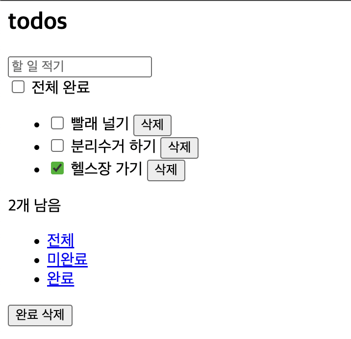

## 이벤트 라이프사이클

[Event](https://developer.mozilla.org/ko/docs/Web/API/Event) 인터페이스는 DOM 내에 위치한 이벤트로 계층 구조를 이룬다. 그 종류에 따라 이벤트 인터페이스를 상속하는 좀 더 구체적인 이벤트 인터페이스로 구현될 수 있다.

이벤트 라이프 사이클은 3단계로 구성된다.

1. 캡쳐 단계: 이벤트가 html부터 목표 요소로 이동한다.
2. 목표 단계: 이벤트가 목표 요소에 도달한다.
3. 버블 단계: 이벤트가 목표 요소로부터 html로 이동한다.

부모와 자식 요소에 이벤트 핸들러가 모두 연결되어 있다면, 자식 요소에서 이벤트가 발생할 때 부모 요소의 이벤트 핸들러도 실행된다. 이를 이벤트 버블링이라 한다. 기본적으로 발생하는 이 현상을 막기 위해서는 `stopPropagation()` 메서드를 사용해야 한다.

부모와 자식의 이벤트 핸들러 중 무엇이 먼저 실행되는지는 `useCapture` 옵션이 결정한다. 만약 `useCapture`가 `false`라면 버블링 단계에서 이벤트 핸들러를 실행한다. 즉 자식의 이벤트 핸들러부터 실행한다. 반면, `useCapture`가 `true`인 경우 캡쳐 단계에서 이벤트 핸들러를 실행하기 때문에 부모의 이벤트 핸들러부터 실행한다.

## 이벤트 핸들러 연결하기

### On* 속성으로 이벤트 핸들러 연결

쉽고 지저분한 방법, 하나의 DOM 요소에 하나의 핸들러만 할당할 수 없다.

### addEventListener로 이벤트 핸들러 연결

[addEventListener()](https://developer.mozilla.org/en-US/docs/Web/API/EventTarget/addEventListener)로 하나의 DOM 요소에 여러 이벤트 핸들러를 연결할 수 있다. [removeEventListener()](https://developer.mozilla.org/en-US/docs/Web/API/EventTarget/removeEventListener)로 이벤트 핸들러를 제거하여 메모리 누수를 방지할 수도 있다.

## 커스텀 이벤트

[Custom Event](https://developer.mozilla.org/ko/docs/Web/API/CustomEvent/CustomEvent)를 만들 수도 있다. 

아래 핸들러는 인풋 값의 길이가 5를 넘어가면 커스텀 이벤트를 생성 및 실행한다. 생성자의 첫 번째 인자에는 이벤트 이름, 두 번째 인자로는 `detail` 속성을 포함하는 옵션을 전달할 수 있다.

```js
const handleChangeInput = (e) => {
  const { length } = e.target.value;

  if (length < 5) {
    console.log('default event');
  } else {
    input.dispatchEvent(new CustomEvent('customEvent', {
      detail: { time: new Date().getTime() }
    }))
  }
}

input.addEventListener('input', handleChangeInput);
input.addEventListener('customEvent', (e) => log(e.target.value, e.detail.time))
```

## 기존 투두리스트 애플리케이션의 문제점

지난 챕터에서 만들었던 애플리케이션은 할 일 요소를 문자열로 생성한다. 

```js{7-18}
const Todos = todo => {
  const {
    text,
    completed
  } = todo

  return `
      <li ${completed ? 'class="completed"' : ''}>
        <div class="view">
          <input 
            ${completed ? 'checked' : ''}
            class="toggle" 
            type="checkbox">
          <label>${text}</label>
          <button class="destroy"></button>
        </div>
        <input class="edit" value="${text}">
      </li>`
}
```

그러나 문자열에는 `addEventListener()`로 이벤트 핸들러를 추가할 수 없다. 다른 방법을 알아보자.

## createElement API

```js
// source: MDN

function addElement () {
  // create a new div element
  var newDiv = document.createElement("div");
  // and give it some content
  var newContent = document.createTextNode("환영합니다!");
  // add the text node to the newly created div
  newDiv.appendChild(newContent);

  // add the newly created element and its content into the DOM
  var currentDiv = document.getElementById("div1");
  document.body.insertBefore(newDiv, currentDiv);
}
```

`createElement API`를 사용하여 새로운 DOM 노드를 생성할 수 있다. 이 방식은 가독성이 그리 좋지 않고 유지보수가 어렵다는 단점이 있다.

## Template element

`<template />`요소는 동적으로 DOM 노드를 생성하는 수단이다. 이 요소는 페이지를 불러오는 순간에는 렌더링되지 않는다. 대신 자바스크립트가 `<template />`기반의 돔 노드를 생성할 수 있다. 컴포넌트 함수에서 문자열로 만들던 내용을 지우고 `<template />` 을 작성한다.

두 개의 템플릿을 추가했다.

1. 할 일 요소 구성을 담는 todo-item 템플릿
2. 전체 앱의 구성을 담는 todo-app 템플릿

```html{6-36}
<html>
  <head>
    <title>todos</title>
  </head>
  <body>
    <template id="todo-item">
      <li>
        <div class="view">
          <input class="toggle" type="checkbox">
          <label></label>
          <button class="destroy">삭제</button>
        </div>
      </li> 
    </template>
    <template id="todo-app">
      <section class="todoapp">
        <header>
          <h1>todos</h1>
          <input class="new-todo" placeholder="할 일 적기" autofocus>
        </header>
        <section class="main">
          <input id="toggle-all" class="toggle-all" type="checkbox">
          <label for="toggle-all">전체 완료</label> 
          <ul data-component="todos"></ul>
        </section>
        <footer class="footer">
          <span data-component="counter"></span>
          <ul data-component="filters">
            <li><a href="#/">전체</a></li>
            <li><a href="#/active">미완료</a></li>
            <li><a href="#/completed">완료</a></li>
          </ul>
          <button class="clear-completed">완료 삭제</button>
        </footer>
      </section>
    </template>
    <script type="module" src="index.js"></script>
  </body>
</html>
```

`Todo` 컴포넌트는 더 이상 문자열을 리턴하지 않는다. `state.todos`를 순회하며 새로운 할 일 목록을 구성하고 반환한다. `createNewTodo()`는 각각의 할 일을 생성한다.

```js{6-8}
const Todos = (targetElement, { todos }) => {
  const newTodoList = targetElement.cloneNode(true);

  newTodoList.innerHTML = '';

  todos
    .map((todo, index) => createNewTodo(todo, index))
    .forEach((todo) => newTodoList.appendChild(todo));

  return newTodoList
}
```

`createNewTodo()`는 할 일의 내용과 속성을 채워준다. `todoElement()`는 DOM 요소를 생성한다.

```js{7-14}
const createNewTodo = (todo, index) => {
  const {
    text,
    completed
  } = todo;

  const element = todoElement();

  element.querySelector('label').textContent = text;

  if (completed) {
    element.classList.add('completed');
    element.querySelector('input.toggle').checked = true;
  }

  return element;
}
```

`todoElement()`는 템플릿을 복제한 요소를 반환한다. 이처럼 템플릿을 재사용하면서 DOM을 동적으로 생성할 수 있다.

```js{5}
let template;

const todoElement = () => {
  if (!template) {
    template = document.getElementById('todo-item');
  }

  return template.content.firstElementChild.cloneNode(true);
};
```

App 컴포넌트는 전체 구성을 담는 todo-app 템플릿을 복제하여 DOM을 생성한다. 

```tsx{5, 16}
let template;

const getTemplate = () => {
  if (!template) {
    template = document.getElementById('todo-app');
  }

  return template.content.firstElementChild.cloneNode(true);
}

export default (targetElement) => {
  const newApp = targetElement.cloneNode(true);

  newApp.innerHTML = '';

  newApp.appendChild(getTemplate());

  return newApp;
}
```

App 컴포넌트도 다른 컴포넌트와 마찬가지로 레지스트리에 등록한다.

```tsx
// index.js

addComponent('app', App);
addComponent('todos', Todos);
addComponent('counter', Counter);
addComponent('filters', Filters);
```

뷰에도 App 컴포넌트가 들어갈 자리가 필요하다.

```html{12-14}
<html>
  <head>
    <title>todos</title>
  </head>
  <body>
    <template id="todo-item">
      <!-- 생략 -->
    </template>
    <template id="todo-app">
      <!-- 생략 -->
    </template>
    <div id="root">
      <div data-component="app"></div>
    </div>
    <script type="module" src="index.js"></script>
  </body>
</html>
```

렌더링 함수는 `.todoapp`이 아닌 `root div`에 접근한다. 

```tsx
const init = () => {
  window.requestAnimationFrame(() => {
    const app = document.querySelector('#root');

    const newApp = renderRoot(app, state);

    renderDiff(document.body, app, newApp);
  })
}
```

이전과 같이 할 일 목록을 보여준다.



최종 프로젝트 구성은 아래와 같다.

```bash
root
├── apis.js
├── components
│   ├── App.js
│   ├── Counter.js
│   ├── Filters.js
│   └── Todos.js
├── index.html
├── index.js
├── registry.js
└── renderDiff.js
```

## 이벤트 추가하기

지금은 버튼만 존재할 뿐 할 일 추가와 같은 이벤트는 발생하지 않는다. 이벤트 추가를 위해 이벤트 레지스트리를 생성하고 등록한다. 이제 모든 컴포넌트 함수는 세 번째 파라미터로 이벤트 레지스트리 `events`를 받는다. 

```js{16-28, 34}
// index.js

// set state
const state = {
  todos: fetchTodos(),
  filter: 'All'
}

// 컴포넌트 레지스트리 등록
addComponent('app', App);
addComponent('todos', Todos);
addComponent('counter', Counter);
addComponent('filters', Filters);

// 이벤트 레지스트리 등록
const events = {
  deleteItem: (index) => {
    state.todos.splice(index, 1);
    init()
  },
  addItem: (text) => {
    state.todos.push({
      text,
      completed: false
    })
    init()
  }
}

const init = () => {
  window.requestAnimationFrame(() => {
    const app = document.querySelector('#root');

    const newApp = renderRoot(app, state, events);

    renderDiff(document.body, app, newApp);
  })
}

init();
```

이벤트 레지스트리에서 필요한 이벤트 함수를 꺼내 이벤트 핸들러로 등록한다.

```js{11-19, 28}
let template;

const getTemplate = () => {
  if (!template) {
    template = document.getElementById('todo-app');
  }

  return template.content.firstElementChild.cloneNode(true);
}

const addKeypressEventListener = (targetElement, events) => {
  targetElement.querySelector('.new-todo').addEventListener('keypress', (e) => {
    if (e.key === 'Enter') {
      events.addItem(e.target.value);

      e.target.value = ''
    }
  })
}

export default (targetElement, _, events) => {
  const newApp = targetElement.cloneNode(true);

  newApp.innerHTML = '';

  newApp.appendChild(getTemplate());

  addKeypressEventListener(newApp, events);

  return newApp;
}
```

Todo 컴포넌트에서도 할 일 삭제 이벤트 핸들러를 등록한다.

```js{26, 28}
let template;

const todoElement = () => {
  if (!template) {
    template = document.getElementById('todo-item');
  }

  return template.content.firstElementChild.cloneNode(true);
};

const createNewTodo = (todo, index, events) => {
  const {
    text,
    completed
  } = todo;

  const element = todoElement();

  element.querySelector('label').textContent = text;

  if (completed) {
    element.classList.add('completed');
    element.querySelector('input.toggle').checked = true;
  }

  const handler = () => events.deleteItem(index);

  element.querySelector('button.destroy').addEventListener('click', handler);

  return element;
}

const Todos = (targetElement, { todos }, events) => {
  const newTodoList = targetElement.cloneNode(true);

  newTodoList.innerHTML = '';

  todos
    .map((todo, index) => createNewTodo(todo, index, events))
    .forEach((todo) => newTodoList.appendChild(todo));

  return newTodoList
}

export default Todos;
```

## 이벤트 위임하기

Todo 컴포넌트는 각 할 일 요소에 이벤트 핸들러를 연결한다. 만약 이벤트 위임을 활용하면 여러 요소를 담는 목록에 하나의 이벤트 핸들러만 할당하여 모든 이벤트를 처리할 수 있다. 

<br>

---

[출처: https://ko.javascript.info/event-delegation](https://ko.javascript.info/event-delegation)

이벤트 위임이란?

> 이벤트 위임은 비슷한 방식으로 여러 요소를 다뤄야 할 때 사용됩니다. 이벤트 위임을 사용하면 요소마다 핸들러를 할당하지 않고, 요소의 공통 조상에 이벤트 핸들러를 단 하나만 할당해도 여러 요소를 한꺼번에 다룰 수 있습니다.

이벤트 위임의 장점

- 많은 핸들러를 할당하지 않아도 되기 때문에 초기화가 단순해지고 메모리가 절약됩니다.
- 요소를 추가하거나 제거할 때 해당 요소에 할당된 핸들러를 추가하거나 제거할 필요가 없기 때문에 코드가 짧아집니다.
- `innerHTML`이나 유사한 기능을 하는 스크립트로 요소 덩어리를 더하거나 뺄 수 있기 때문에 DOM 수정이 쉬워집니다.

이벤트 위임의 단점

- 이벤트 위임을 사용하려면 이벤트가 반드시 버블링 되어야 합니다. 하지만 몇몇 이벤트는 버블링 되지 않습니다. 그리고 낮은 레벨에 할당한 핸들러엔 `event.stopPropagation()`를 쓸 수 없습니다.
- 컨테이너 수준에 할당된 핸들러가 응답할 필요가 있는 이벤트이든 아니든 상관없이 모든 하위 컨테이너에서 발생하는 이벤트에 응답해야 하므로 CPU 작업 부하가 늘어날 수 있습니다. 그런데 이런 부하는 무시할만한 수준이므로 실제로는 잘 고려하지 않습니다.  

---

<br>

먼저 각 버튼에 인덱스를 부여하고 할 일 목록에 이벤트 리스너를 등록한다. [Element.matches()](https://developer.mozilla.org/en-US/docs/Web/API/Element/matches) 메서드를 통해 삭제 버튼임을 식별하고 필요한 일을 한다.

```js{26, 40-44}
let template;

const todoElement = () => {
  if (!template) {
    template = document.getElementById('todo-item');
  }

  return template.content.firstElementChild.cloneNode(true);
};

const createNewTodo = (todo, index, events) => {
  const {
    text,
    completed
  } = todo;

  const element = todoElement();

  element.querySelector('label').textContent = text;

  if (completed) {
    element.classList.add('completed');
    element.querySelector('input.toggle').checked = true;
  }

  element.querySelector('button.destroy').dataset.index = index;

  return element;
}

const Todos = (targetElement, { todos }, events) => {
  const newTodoList = targetElement.cloneNode(true);

  newTodoList.innerHTML = '';

  todos
    .map((todo, index) => createNewTodo(todo, index, events))
    .forEach((todo) => newTodoList.appendChild(todo));

  newTodoList.addEventListener('click', (e) => {
    if (e.target.matches('button.destroy')) {
      events.deleteItem(e.target.dataset.index);
    }
  })

  return newTodoList
}

export default Todos;
```

리스트가 아주 길다면 이 같은 이벤트 위임 방식은 성능과 메모리 사용성을 개선시킬 수 있다.

## 출처
_프란세스코 스트라츨로, [『프레임워크 없는 프론트엔드 개발』](https://search.shopping.naver.com/book/search?bookTabType=ALL&pageIndex=1&pageSize=40&query=%ED%94%84%EB%A0%88%EC%9E%84%EC%9B%8C%ED%81%AC%20%EC%97%86%EB%8A%94%20%ED%94%84%EB%A1%A0%ED%8A%B8%EC%97%94%EB%93%9C%20%EA%B0%9C%EB%B0%9C&sort=REL), 에이콘 출판(2021.01.21.)_
