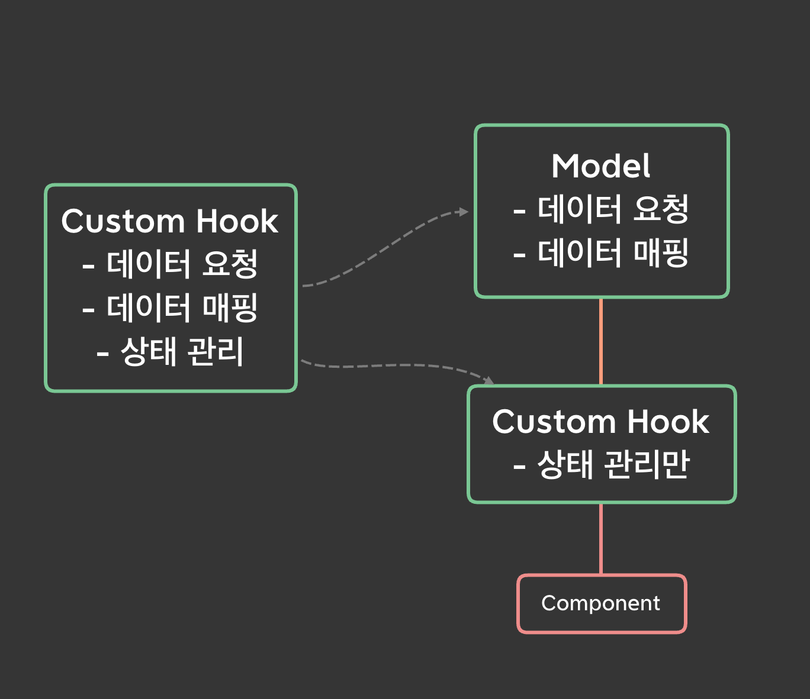

## AJAX(Asynchronous Javascript and XML)

[AJAX](https://developer.mozilla.org/ko/docs/Web/Guide/AJAX) 애플리케이션의 핵심은 [XMLHttpRequest](https://developer.mozilla.org/ko/docs/Web/API/XMLHttpRequest) 객체다. AJAX에서는 X는 XML을 나타낸다. 그만큼 과거에는 주로 XML형식의 데이터를 수신했다. 최근에는 JSON 객체를 주로 사용하는데 MDN에서는 그 이유를 JSON 객체가 자바스크립트의 일부이고 더 가볍기 때문이라고 설명한다.

<br/>

## HTTP 인터페이스

저자는 소프트웨어 디자인의 가장 중요한 원칙 중 하나를 소개한다.

> 구현이 아닌 인터페이스로 프로그래밍하라.  
> \- Gang of Four 

<br/>

여러 곳에서 HTTP 클라이언트 API로 네트워크 요청을 하는 아주 거대한 애플리케이션이 있다고 가정해 보자. 만약 [Fetch API](https://developer.mozilla.org/ko/docs/Web/API/Fetch_API)를 사용하다가 [Axios](https://axios-http.com/)로 교체해야 하는 순간이 온다면, 비용이 큰 매우 지루한 작업을 해야만 한다.

> 라이브러리를 사용할 때는 이에 대한 인터페이스를 생성하라. 필요시 새로운 라이브러리로 쉽게 변경할 수 있다.  

<br/>

예를 들어 어떤 함수는 직접 네트워크를 요청하지 않고 모델 객체가 제공하는 메서드로 원하는 것을 얻는다.

```jsx
// index.js

import todo from './todo.js';

const getTodoList = async () => {
  const result = await todos.list()
  // do something
}
```

모델은 HTTP 인터페이스를 통해 모델의 특정 데이터를 제공하는 메서드를 갖는다.

```jsx
// todo.js

import http from './http.js';

const list = () => http.get(BASE_URL);
```

HTTP 인터페이스는 실제 사용하고 있는 HTTP 클라이언트 API를 래핑하고 내부 구현을 감춘다.

```jsx
// http.js

const request = async params => {
  const {
    method = 'GET',
    url,
    headers = {},
    body
  } = params

  const config = {
    url,
    method,
    headers,
    data: body
  }

  return axios(config)
}

const get = async (url, headers) => {
  const response = await request({
    url,
    headers,
    method: 'GET'
  })

  return response.data
}

// post, delete 기타 등등...
```

<br/>

## 회사 코드에 모델 레이어 추가를  제안했다

### 기존 코드의 문제점

이 챕터를 읽을 당시 내가 맡던 회사 프로젝트는 마침 몇가지 문제를 갖고 있었다.

- 데이터 의존도가 매우 높다. 같은 데이터 모델을 공유하기 위해 서버의 인터페이스를 가급적 그대로 사용하는 편이지만 그렇기 때문에 서버 인터페이스의 작은 변경에도 취약한 구조를 가진다. 데이터 특성상 그 깊이도 매우 깊다. 자료의 인터페이스가 바뀌면 커스텀 훅부터 뷰 컴포넌트까지 모두 바꿔줘야 하는 경우가 잦다.
- 커스텀 훅이 매우 비대하다. 상태 관리 외에도 데이터 요청, 에러 핸들링 등의 역할을 수행하고 있다. 커스텀 훅의 책임이 많은 만큼 테스트를 작성하는 것도 어렵다.
- 여러 커스텀 훅, 심지어 컴포넌트에서도 HTTP 클라이언트 API(`Apollo Client`)를 직접 사용하고 있다. 같은 모델에 대한 데이터를 요청하는 코드가 여러 곳에 산재되어 코드 응집도(?)가 낮아 유지 보수가 어렵다. 이런 경우 중복 코드가 많아질 수 있다. 테스트를 작성할 때마다 `Apollo Client`를 모킹해야 한다.
- HTTP 클라이언트 라이브러리에 관한 의존도가 높다. 만약 `Apollo Client`가 아닌 다른 라이브러리를 사용하게 된다면 관련 코드를 모두 찾아내어 수정해야 한다.

신입 개발자로서 제안한다는 것이 부담스러웠지만 그간 겪었던 불편함, 나중에 겪게 될 수도 있는 고통이 염려되어 조심스럽게 간단한 예시와 함께 PR을 올렸다. 내가 제안한 것은 모델이란 하나의 계층을 추가하여 커스텀 훅이나 컴포넌트로부터 네트워크 요청이라는 책임을 분리하자는 내용이었다. 책에서 봤던 모델 계층을 활용하지만 당장은 큰 변화처럼 느껴지는 HTTP 인터페이스 구현체는 고려하지 않았다.



예를 들어, `useTodoList()`는 `todo`모델이 제공하는 메서드로 데이터를 받는다.

```jsx{4-10}
const useTodoList = () => {
  const [todoList, setTodoList] = useState<TodoList>();

  useEffect(() => {
    (async () => {
      const todoList = await todo.list();

      setTodoList(todoList);
    })();
  }, []);

  return {
    todoList
  };
};
```

다만, 모델 객체는 컴포넌트나 훅이 아니기 때문에 Apollo Client에서 제공하는 훅을 사용할 수 없었다. 그래서 core API를 사용해야만 했는데 query, mutation은 큰 어려움이 없었지만 subscription의 경우 사용하는 곳에서 명시적으로 unsubscribe를 해야 한다는 문제가 있었다. 물론 방법이야 있겠지만 당시에는 찾지 못했다.

```jsx{8-31}
import { client } from '@clients/apollo/client';

interface TodoModel {
  list: (update: (data: TodoList) => void) => Subscription;
  item: (todoId: string) => Promise<Todo>;
}

const todo: TodoModel = {
  list: (update) => {
    return client.subscribe({ query: GET_TODO_LIST }).subscribe({
      next({ data }) {
        const todoList = data.todos.map((todo) => {
          return {
            // 인터페이스에 맞게 데이터 매핑, 구조 분해 할당
          };
        });

        update(todoList);
      }
    });
  },
  item: async (todoId: string) => {
    const response = await client.query({ query: GET_TODO, variables: { todoId } });

    const todo = await response.data.todos[0];

    return {
       // 인터페이스에 맞게 데이터 매핑, 구조 분해 할당
    };
  },
};

export default todo;
```

그럼에도 불구하고 내가 생각한 모델 계층을 분리하여 얻는 이점은 이랬다.

- 데이터 의존도가 낮아진다. 목 데이터 제공, API 새로 붙이기, API 교체 작업 등은 모델 계층에서만 하면 되기 때문이다. 모델 계층에서 원하는 형태의 데이터를 전달하기 때문에 데이터 출처나 소싱 방법이 바뀌더라도 커스텀 훅과 컴포넌트의 코드는 그대로 유지할 수 있다.
- 커스텀 훅에서 데이터 요청 로직이 분리됨에 따라 테스트 코드 작성이 비교적 쉽다. `MockProvider`에 길게 선언된 mock 객체를 전달하여 테스트하는 방식보다 모델 객체를 단순 모킹하는 것이 더 편리하다.
- 모델 중심으로 코드가 모여있기 때문에 유지 보수가 편리하고 가독성이 좋다. 중복 코드도 제거할 수 있다.
- HTTP 클라이언트 라이브러리에 관한 의존도가 낮다. 다른 라이브러리를 사용하게 되더라도 교체가 쉽다.
- 변경에 보다 더 유연하게 대처할 수 있으면서도 현재 구조에서 크게 공수가 들지 않는 방법이다.

염려하는 부분도 있었다. 그건 Apollo client에서 제공하는 훅을 사용하지 않기 때문에 낯선 코드를 접해야 하고 예상치 못한 문제를 만날 수 있다는 것과 적은 지식을 바탕으로 제안한 내용이라 좋은 방법이 아닐 가능성이 다분하다는 사실이었다. 

### 내가 놓쳤던 부분 그리고 후기

결과적으로 내가 제안한 모양이 그대로 수용되진 않았다. 그러나 내 제안에 관한 오랜 논의를 거쳤고 그 중에는 내가 납득할 만한 이유가 있었다. 우선, 사용하는 곳에서 명시적으로 subscription을 해제해야 하는 부분이 아쉽다. 무엇보다 Apollo에서 제공하는 Hook 사용을 포기할 만큼의 장점이 느껴지진 않았다. 이는 충분히 공감하는 내용이었고 apollo의 core API를 사용하면서 어떤 문제가 발생할지 예측할 수 없다. 그리고 나중에 든 생각이지만 유지보수까지 고려한다면 API의 공식 문서에서도 제공하지 않는 내용이 가까운 미래에 혼란을 초래할 수도 있다는 생각이 들었다. 

하지만 소득이 적진 않았다. 서버 인터페이스에 대한 의존도를 낮춰야 한다는 사실에 대해서는 충분한 공감대가 형성됐기 때문이다. 팀장님과 논의 끝에 모델 계층을 추가하는 대신 API 계층을 추가했다. 그 형태는 React Hook의 형태가 됐다. Apollo에서 제공하는 훅을 사용해야 했기 때문이다. 하지만 이것만으로는 초기 목적 중 하나인 모델 중심으로 코드를 관리하고자 했던 바램을 이룰 수 없었다. 그래서 데이터 모델에 따라 디렉토리를 구분하여 API hook을 관리하도록 했다. 논의 끝에 최종적으로 합의된 내용은 아래와 같다.

1. 통신 로직을 `API hook`의 형태로 하나의 계층으로서 분리한다.
    - `apollo`에서 제공하는 `hook`을 사용할 수 있음
    - 사용하는 곳에서 섭스크립션을 명시적으로 해제하지 않아도 됨
    - 관심사 또는 계층 분리 가능
    - 커스텀 훅의 테스트 용이성 확보
2. `API hook`은 하나 이상의 `adapter` 함수를 가질 수 있다.
    - 만약 adapter가 비대해지면 또 하나의 계층으로도 분리 가능
3. 디렉토리 구조는 `src/apis/todos`와 같이 데이터 중심으로 분리한다.
    - 기존 `src/hooks`과 통신 훅을 분리
    - 통신 로직을 디렉토리로 구분 및 관리하여 중복된 훅 생성 방지할 수 있음

사실 작업하면서 느꼈던 불편함을 빠르게 해소하고 싶어 가볍게 제안한건데 논의가 길어지면서 충분히 단단한 내용을 준비하지 못한 것에 대해 반성하기도 했다. 하지만 당시 내 실력으로 더 고민하는 것보다 문제를 공유하고 팀원들과 함께 고민하고 싶은 마음이 더 컸기 때문에 너무 오래 끌지 않은 것이 결국 더 좋은 판단이었다는 생각을 했다. 불편함을 공유하고 서버 인터페이스에 대한 종속성 문제를 적시에 해결하려는 주 목적을 달성했기 때문이다.

<br/>

## 출처
_프란세스코 스트라츨로, [『프레임워크 없는 프론트엔드 개발』](https://search.shopping.naver.com/book/search?bookTabType=ALL&pageIndex=1&pageSize=40&query=%ED%94%84%EB%A0%88%EC%9E%84%EC%9B%8C%ED%81%AC%20%EC%97%86%EB%8A%94%20%ED%94%84%EB%A1%A0%ED%8A%B8%EC%97%94%EB%93%9C%20%EA%B0%9C%EB%B0%9C&sort=REL), 에이콘 출판(2021.01.21.)_