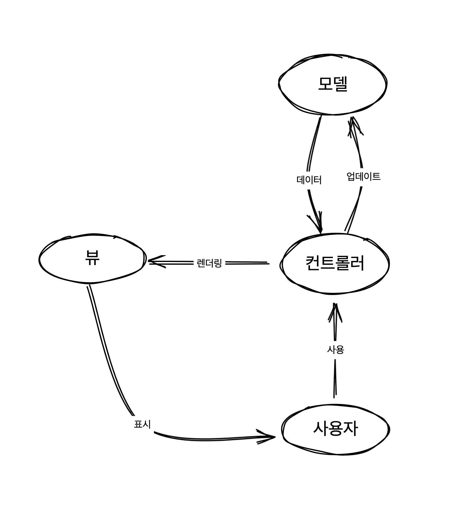
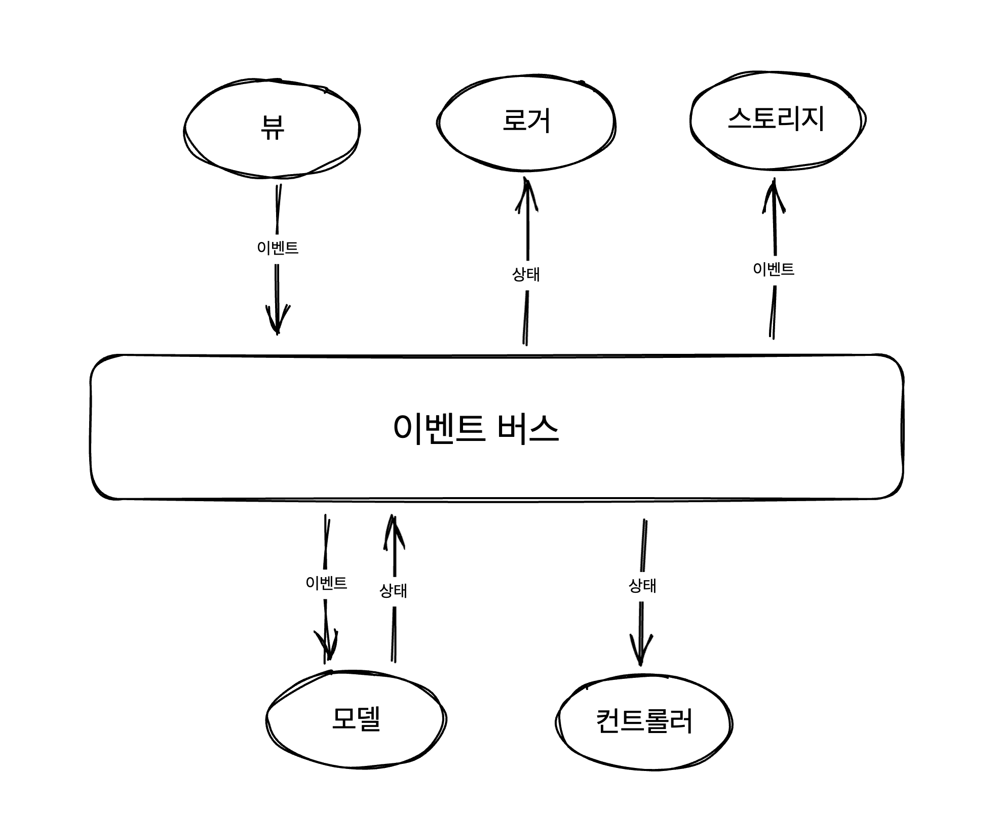

## 상태 관리

애플리케이션의 다양한 요소를 연결하는 효과적인 데이터 관리 방법을 상태 관리라고 한다. [Redux](https://redux.js.org/)나 [MobX](https://mobx.js.org/react-integration.html)와 같은 상태 관리 전용 라이브러리도 있다. 그만큼이나 애플리케이션에서 중요한 축을 담당하고 있다. 상태 관리에 적합한 아키텍쳐를 선택한다면 애플리케이션을 건강하게 유지할 수 있다.

<br/>

## 사전 준비

3장에서 구현했던 투두리스트 앱을 사용한다. 새로운 구현에 앞서 변경된 코드를 먼저 살펴본다.

뷰
```html
<html>
  <head>
    <title>todos</title>
  </head>
  <body>
    <template id="todo-item">
      <li>
        <div class="view">
          <input class="toggle" type="checkbox">
          <label></label>
          <button class="destroy">삭제</button>
        </div>
      </li> 
    </template>
    <template id="todo-app">
      <section class="todoapp">
        <header>
          <h1>todos</h1>
          <input class="new-todo" placeholder="할 일 적기" autofocus>
        </header>
        <section class="main">
          <button class="completed-all" >전체 완료</button>
          <ul data-component="todos"></ul>
        </section>
        <footer class="footer">
          <span data-component="counter"></span>
          <button class="clear-completed">완료 삭제</button>
        </footer>
      </section>
    </template>
    <div id="root">
      <div data-component="app"></div>
    </div>
    <script type="module" src="index.js"></script>
  </body>
</html>
```

컨트롤러

```js
// index.js

import { fetchTodos } from "./apis.js";

import App from './components/App.js';
import Todos from './components/Todos.js';
import Counter from './components/Counter.js';

import { addComponent, renderRoot } from './registry.js';
import renderDiff from './renderDiff.js';

const state = {
  todos: fetchTodos(),
}

addComponent('app', App);
addComponent('todos', Todos);
addComponent('counter', Counter);

const events = {
  deleteItem: (index) => {
    state.todos.splice(index, 1);
    render();
  },
  addItem: (text) => {
    state.todos.push({
      text,
      completed: false
    })
    render();
  },
  completedAll: () => {
    state.todos = state.todos.map(todo => ({
      ...todo,
      completed: true
    }))
    render();
  },
  clearCompleted: () => {
    state.todos = state.todos.filter(todo => !todo.completed);
    render();
  }
}

const render = () => {
  window.requestAnimationFrame(() => {
    const app = document.querySelector('#root');

    const newApp = renderRoot(app, state, events);

    renderDiff(document.body, app, newApp);
  })
}

render();
```

App 컴포넌트

```js
let template;

const getTemplate = () => {
  if (!template) {
    template = document.getElementById('todo-app');
  }

  return template.content.firstElementChild.cloneNode(true);
}

const addEventListeners = (target, events) => {
  target.querySelector('.new-todo').addEventListener('keypress', (e) => {
    if (e.key === 'Enter') {
      events.addItem(e.target.value);

      e.target.value = ''
    }
  })

  target.querySelector('.completed-all').addEventListener('click', () => {
    events.completedAll();
  })

  target.querySelector('.clear-completed').addEventListener('click', () => {
    events.clearCompleted();
  })
}

export default (targetElement, _, events) => {
  const newApp = targetElement.cloneNode(true);

  newApp.innerHTML = '';

  newApp.appendChild(getTemplate());

  addEventListeners(newApp, events);

  return newApp;
}
```

사전 준비를 위해 변경한 내용은 아래와 같다. 나머지 코드는 동일하다.

- 단순화를 위해 필터의 구성을 제거했다.
- `init()`함수의 이름을 `render()`로 변경했다.
- 전체 완료, 완료 삭제 이벤트를 추가했다.

시작하기에 앞선 프로젝트의 구조는 이렇다.

```bash
root
├── apis.js
├── components
│   ├── App.js
│   ├── Counter.js
│   └── Todos.js
├── index.html
├── index.js
├── registry.js
└── renderDiff.js
```

<br/>

## 모델-뷰-컨트롤러


> 상태를 컨트롤러에서 유지하는 것은 상태 관리의 좋은 방법은 아니다.


애플리케이션의 상태는 모델이 관리한다. 상태 변경 함수 외에도 다음 구성이 있다.

- `getState()`는 상태 복사본을 불변 객체로서 반환한다.
- 객체의 깊은 복사를 위해 JSON 메서드를 활용한다. 이 방법은 속도가 느릴 수 있다.  (저자는 [lodash](https://www.geeksforgeeks.org/lodash-_-clonedeep-method/)에서 제공하는 `cloneDeep()`를 추천하고 있다.)
- 모델은 초기 상태를 받는다. 만약 없다면 기본 값을 사용한다.

```js
// model/model.js

const INITIAL_STATE = {
  todos: [],
}

export default (initalState = INITIAL_STATE) => {
  const state = cloneDeep(initalState)

  const getState = () => {
    return Object.freeze(cloneDeep(state))
  }

  const addItem = text => {
    if (!text) return;

    state.todos.push({
      text,
      completed: false
    })
  }

  const deleteItem = index => {
    if (index < 0) return

    if (!state.todos[index]) return

    state.todos.splice(index, 1)
  }

  const completeAll = () => {
    state.todos = state.todos.map(todo => ({
      ...todo,
      completed: true,
    }))
  }

  const clearCompleted = () => {
    state.todos = state.todos.filter(t => !t.completed)
  }

  return {
    addItem,
    deleteItem,
    completeAll,
    clearCompleted,
    getState
  }
}
```

컨트롤러는 모델을 사용할 뿐이다. 모델이 불변 객체를 제공하기 때문에 데이터를 조작하기 위해서는 모델이 제공하는 공개 메서드를 사용해야 한다.

```js{15-34, 40, 46}
import { fetchTodos } from "./apis.js";

import App from './components/App.js';
import Todos from './components/Todos.js';
import Counter from './components/Counter.js';

import { addComponent, renderRoot } from './registry.js';
import renderDiff from './renderDiff.js';
import modelFactory from "./model/model.js";

addComponent('app', App);
addComponent('todos', Todos);
addComponent('counter', Counter);

const model = modelFactory({ todos: fetchTodos() });

const events = {
  addItem: (text) => {
    model.addItem(text);
    render(model.getState());
  },
  deleteItem: (index) => {
    model.deleteItem(index);
    render(model.getState());
  },
  completeAll: () => {
    model.completeAll();
    render(model.getState());
  },
  clearCompleted: () => {
    model.clearCompleted();
    render(model.getState());
  }
}

const render = (state) => {
  window.requestAnimationFrame(() => {
    const app = document.querySelector('#root');

    const newApp = renderRoot(app, state, events);

    renderDiff(document.body, app, newApp);
  })
}

render(model.getState());
```

이는 고전적인 MVC 애플리케이션의 구현이다. 이 패턴은 아래와 같은 모양이다.



<br/>

## 옵저버블 모델

MVC 기반으로 작성한 코드가 최적의 솔루션이라 할 수는 없는데 그 이유는

- 상태 변경 후 렌더링을 수동으로 호출해야 한다.
- 동작이 상태를 변경하지 않을 때에도 `render()`를 호출한다.

저자는 이러한 문제 해결을 위해 옵저버 패턴을 소개한다. 옵저버블 모델은 게터 대신 `addChangeListener()`라는 메서드를 제공한다. 

- 모델은 리스너를 등록, 삭제할 수 있는 수단을 제공한다. - `addChangeListener()`
- 리스너를 실행하여 상태 변경을 통지한다. - `invokeListeners()`

```js{12-26, 36, 36, 55, 61}
// model/model.js

const INITIAL_STATE = {
  todos: [],
}

export default (initalState = INITIAL_STATE) => {
  const state = cloneDeep(initalState)

  let listeners = []

  const addChangeListener = (listener) => {
    listeners.push(listener);

    listener(freeze(state));

    return () => {
      listeners = listeners.filter(l => l !== listener);
    }
  }

  const invokeListeners = () => {
    const data = freeze(state);

    listeners.forEach(l => l(data));
  }

  const addItem = text => {
    if (!text) return;

    state.todos.push({
      text,
      completed: false
    })

    invokeListeners();
  }

  const deleteItem = index => {
    if (index < 0) return

    if (!state.todos[index]) return

    state.todos.splice(index, 1)

    invokeListeners();
  }

  const completeAll = () => {
    state.todos = state.todos.map(todo => ({
      ...todo,
      completed: true,
    }))

    invokeListeners();
  }

  const clearCompleted = () => {
    state.todos = state.todos.filter(t => !t.completed)

    invokeListeners();
  }

  return {
    addItem,
    deleteItem,
    completeAll,
    clearCompleted,
    addChangeListener
  }
}
```

이벤트 등록은 더 이상 컨트롤러의 관심사가 아니다. 모델에서 제공하는 메서드를 이벤트 핸들러에서 사용한다. 컨트롤러는 `render()`를 직접 실행하지 않고 리스너로 등록할 뿐이다. 코드가 훨씬 간결해졌다.

```js
// ... 생략

const model = modelFactory({ todos: fetchTodos() });

const {
  addChangeListener,
  ...events
} = model;

const render = (state) => {
  window.requestAnimationFrame(() => {
    const app = document.querySelector('#root');

    const newApp = renderRoot(app, state, events);

    renderDiff(document.body, app, newApp);
  })
}

// 리스너 전달
addChangeListener(render);
```

> 옵저버블 모델은 모델의 공개 인터페이스를 수정하지 않고 컨트롤러에 새로운 기능을 추가하는 데 유용하다.
> 

무엇을 어떻게 할지는 컨트롤러가 정한다. 모델은 등록된 리스너를 실행할 뿐이다. 만약 상태 변경을 알리는 간단한 로거를 추가하고 싶다면 리스너를 추가하기만 하면 된다. 

```js
addChangeListener(state => {
  console.log(`현재 시각 (${new Date()})`, state)
})
```

<br/>

## 반응형 프로그래밍

> 간단히 말하면 반응형 패러다임의 구현은 애플리케이션이 모델 변경, HTTP 요청, 사용자 동작, 탐색 등과 같은 이벤트를 방출할 수 있는 옵저버블로 동작하도록 구현하는 것을 의미한다.
> 

반응형 프로그래밍은 내게 아직 낯선 주제이다. 저자는 반응형 프로그래밍을 소개하는 안드레 스탈츠의 [글](https://gist.github.com/staltz/868e7e9bc2a7b8c1f754)을 추천한다. 위에서 만든 옵저버블 모델은 반응형 상태 관리의 예라고 할 수 있다. 하지만 여러 모델 객체를 갖고 있다면 옵저버블을 만들 수 있는 더 쉬운 방법이 필요하다. 이런 경우에 사용해 볼 수 있는 옵저버블 팩토리를 만들어 본다.

```js
// model/observable.js

export default (model, stateGetter) => {
  let listeners = []

  const addChangeListener = cb => {
    listeners.push(cb)
    cb(freeze(stateGetter()))

    return () => {
      listeners = listeners.filter(listener => listener !== cb)
    }
  }

  const invokeListeners = () => {
    const data = freeze(stateGetter())
    listeners.forEach(listener => listener(data))
  }

  const wrapAction = originalAction => {
    return (...args) => {
      const value = originalAction(...args)
      invokeListeners()
      return value
    }
  }

  const baseProxy = {
	
    addChangeListener
  }

  return Object
    .keys(model)
    .filter(key => typeof model[key] === 'function')
    .reduce((proxy, key) => {
      const action = model[key]

      return {
        ...proxy,
        [key]: wrapAction(action)
      }
    }, baseProxy)
}
```

옵저버블 팩토리는 모델의 상태 변경 함수를 래핑하여 상태가 변경될 때마다 변경 사실을 알리도록 한다.  
이제 모델은 옵저버블 객체 생성을 위한 로직을 다루지 않는다. 대신 옵저버블 팩토리로 래핑된 자신을 반환한다.

```js{47}
// model/model.js

import observableFactory from "./observable.js"

const INITIAL_STATE = {
  todos: [],
}

export default (initalState = INITIAL_STATE) => {
  const state = cloneDeep(initalState)

  const addItem = text => {
    if (!text) return;

    state.todos.push({
      text,
      completed: false
    })
  }

  const deleteItem = index => {
    if (index < 0) return

    if (!state.todos[index]) return

    state.todos.splice(index, 1);
  }

  const completeAll = () => {
    state.todos = state.todos.map(todo => ({
      ...todo,
      completed: true,
    }))
  }

  const clearCompleted = () => {
    state.todos = state.todos.filter(t => !t.completed)
  }

  const model = {
    addItem,
    deleteItem,
    completeAll,
    clearCompleted,
  }

  return observableFactory(model, () => state);
}
```

## 네이티브 프록시

자바스크립트의 [Proxy API](https://developer.mozilla.org/ko/docs/Web/JavaScript/Reference/Global_Objects/Proxy)를 사용하면 객체에 대한 프록시를 만들 수 있다. 프록시란 ‘대리’의 의미로 여기서 프록시 객체는 어떤 객체의 대리인 역할을 수행한다. 객체가 갖는 기본적인 작업을 가로채서 그 방법을 다시 정의한다.

```js
const user = {
  id: '1',
  name: 'aiden',
}

const handler = {
  get(target, prop) {
    return target[prop] + ' by Proxy';
  }
}

const userProxy = new Proxy(user, handler);

console.log(userProxy.id); // 1 by Proxy
console.log(userProxy.name); // aiden by Proxy
```

프록시를 활용한 옵저버블 팩토리를 좀 더 간단하게 만들 수 있다. 프록시 생성자는 대상 객체와 핸들러 객체를 받는다. 여기서 대상 객체는 상태가 되고 핸들러 객체는 상태가 변경할 때마다 변경 사실을 알리는 세터를 포함한다.

```js
export default (initialState) => {
  let listeners = [];

  const proxy = new Proxy(cloneDeep(initialState), {
    set: (target, prop, value) => {
      target[prop] = value
      listeners.forEach(listener => listener(freeze(proxy)))
      return true
    }
  })

  proxy.addChangeListener = cb => {
    listeners.push(cb)
    cb(freeze(proxy))
    return () => {
      listeners = listeners.filter(listener => listener !== cb)
    }
  }

  return proxy
}
```

이제 팩토리는 모델 전체를 래핑하는 대신 상태의 프록시를 반환한다. 모델은 상태를 직접 변경할 수 없고 프록시를 통해 변경해야 한다. 그렇기 때문에 상태를 직접 수정하는 메서드를 사용할 수 없음에 유의해야 한다. 변경을 위해서는 새로운 속성으로 교체해야 한다. 

```js{8, 13-16}
import observableFactory from "./observable.js"

const INITIAL_STATE = {
  todos: [],
}

export default (initalState = INITIAL_STATE) => {
  const state = observableFactory(initalState);

  const addItem = text => {
    if (!text) return;

    state.todos = [
      ...state.todos,
      { text, completed: false }
    ]
  }

  const deleteItem = index => {
    if (index < 0) return

    if (!state.todos[index]) return

    state.todos = state.todos.filter((todo, i) => {
      return i !== index
    });
  }

  const completeAll = () => {
    state.todos = state.todos.map(todo => ({
      ...todo,
      completed: true,
    }))
  }

  const clearCompleted = () => {
    state.todos = state.todos.filter(t => !t.completed)
  }

  return {
    addChangeListener: state.addChangeListener,
    addItem,
    deleteItem,
    completeAll,
    clearCompleted,
  }
}
```

<br/>

## 이벤트 버스

> 이벤트 버스는 이벤트 주도 아키텍쳐(Event-Driven Architecture)를 구현하는 하나의 방법이다.
> 

이벤트 버스 패턴을 사용해 상태를 관리하는 방법이다. 리덕스를 사용해 봤다면 이 패턴과 아주 유사하다는 사실을 알 수 있다. 이벤트는 발생한 상황을 식별하는 이름과 이벤트 처리를 위한 정보를 담는 payload를 포함한다. (마치 리덕스의 액션과 같다).

```js
const event = { type: 'ADD_ITEM', payload: item }
```

이벤트 버스는 이벤트를 받아 처리한다. 기본 개념은 단일 객체가 모든 이벤트를 처리한다는 것이다.



이벤트 버스는 옵저버블 팩토리와 달리 모델을 래핑하지 않고 모델을 받아 사용한다. `dispatch()`는 이벤트에 따라 상태를 갱신하고 상태의 변경을 알린다.

```js
// model/eventBus.js

export default (model) => {
  let listeners = []
  let state = model()

  const subscribe = listener => {
    listeners.push(listener)

    return () => {
      listeners = listeners.filter(l => l !== listener)
    }
  }

  const invokeSubscribers = () => {
    const data = freeze(state)
    listeners.forEach(listener => l(data))
  }

  const dispatch = event => {
    const newState = model(state, event)

    if (!newState) {
      throw new Error('model should always return a value')
    }

    if (newState === state) {
      return
    }

    state = newState

    invokeSubscribers()
  }

  return {
    subscribe,
    dispatch,
    getState: () => freeze(state)
  }
}
```

모델은 이벤트에 따라 매핑된 메서드를 갖는다. 각 메서드는 직접 상태를 조작한다. 모델을 사용하는 곳에서는 이전 상태와 함께 이벤트 객체를 전달해야 한다. 유효한 이벤트라면 모델은 새로운 상태를 반환한다.

```js{54-75}
// model/model.js

const INITIAL_STATE = {
  todos: [],
}

const addItem = (state, event) => {
  const { text } = event.payload;

  if (!text) return;

  return {
    ...state,
    todos: [
      ...state.todos,
      { text, completed: false }
    ]
  }
}

const deleteItem = (state, event) => {
  const { index } = event.payload;

  if (index < 0) return state;

  if (!state.todos[index]) {
    return state;
  }

  return {
    ...state,
    todos: state.todos.filter((_, i) => i !== index)
  }
}

const completeAll = (state, event) => {

  return {
    ...state,
    todos: state.todos.map(todo => ({
      ...todo,
      completed: true,
    }))
  }
}

const clearCompleted = (state, event) => {
  return {
    ...state,
    todos: state.todos.filter(t => !t.completed)
  }
}

const methods = {
  ADD_ITEM: addItem,
  DELETE_ITEM: deleteItem,
  COMPLETE_ALL: completeAll,
  CLEAR_COMPLETED: clearCompleted
}

export default (initalState = INITIAL_STATE) => {
  return (prevState, event) => {
    if (!prevState) {
      return cloneDeep(initalState)
    }

    const currentModifier = methods[event.type]

    if (!currentModifier) {
      return prevState
    }

    return currentModifier(prevState, event)
  }
}
```

컨트롤러는 이벤트 버스를 사용한다. `render()`를 리스너로 등록하고 처음에만 `render()`를 직접 실행한다.

```js{9-10, 16, 22, 24}
// index.js

// import 구문 생략

addComponent('app', App);
addComponent('todos', Todos);
addComponent('counter', Counter);

const model = modelFactory({ todos: fetchTodos() });
const eventBus = eventBusFactory(model);

const render = (state) => {
  window.requestAnimationFrame(() => {
    const app = document.querySelector('#root');

    const newApp = renderRoot(app, state, eventBus.dispatch);

    renderDiff(document.body, app, newApp);
  })
}

eventBus.subscribe(render);

render(eventBus.getState());
```

이벤트 생성자는 이벤트 객체를 생성한다. 상태 변경에 필요한 정보가 있다면 이벤트 타입과 함께 payload에 정보를 실어야 한다.

```js
// model/eventCreator.js

const EVENT_TYPES = Object.freeze({
  ADD_ITEM: 'ADD_ITEM',
  DELETE_ITEM: 'DELETE_ITEM',
  COMPLETE_ALL: 'COMPLETE_ALL',
  CLEAR_COMPLETED: 'CLEAR_COMPLETED'
})

export default {
  addItem: (text) => ({
    type: EVENT_TYPES.ADD_ITEM,
    payload: text
  }),
  deleteItem: (index) => ({
    type: EVENT_TYPES.DELETE_ITEM,
    payload: index
  }),
  completeAll: () => ({
    type: EVENT_TYPES.COMPLETE_ALL
  }),
  clearCompleted: () => ({
    type: EVENT_TYPES.CLEAR_COMPLETED
  }),
}
```

예를 들어, App 컴포넌트는 `dispatch()`를 통해 이벤트 발생을 알린다. 이 때 `dispatch()`의 인자로 전달하는 이벤트 객체는 이벤트 생성자로 만든다.

```js{1, 16-17, 23-24, 28-29}
import eventCreator from "../model/eventCreator.js";

let template;

const getTemplate = () => {
  if (!template) {
    template = document.getElementById('todo-app');
  }

  return template.content.firstElementChild.cloneNode(true);
}

const addEventListeners = (target, dispatch) => {
  target.querySelector('.new-todo').addEventListener('keypress', (e) => {
    if (e.key === 'Enter') {
      const event = eventCreator.addItem({ text: e.target.value });
      dispatch(event);
      e.target.value = ''
    }
  })

  target.querySelector('.completed-all').addEventListener('click', () => {
    const event = eventCreator.completeAll();
    dispatch(event);
  })

  target.querySelector('.clear-completed').addEventListener('click', () => {
    const event = eventCreator.clearCompleted();
    dispatch(event);
  })
}

export default (targetElement, _, dispatch) => {
  const newApp = targetElement.cloneNode(true);

  newApp.innerHTML = '';

  newApp.appendChild(getTemplate());

  addEventListeners(newApp, dispatch);

  return newApp;
}
```

<br/>

## 상태 관리 전략 비교

지금까지 다뤘던 상태 관리 전략을 간단하게 비교한다. 어떤 전략이 항상 좋다고 할 수는 없다.

### MVC

MVC 패턴은 구현이 쉽고 관심사 분리에도 좋다. 그러나 모델, 뷰, 컨트롤러 중 어디에도 넣기 어려운 회색 영역이 존재하기 쉽다. 그래서 엄격하게 구현하는 것에 어려움이 따른다. 확장성도 좋다고 할 수 없다.

### 반응형 프로그래밍

추상화를 통해 코드의 일관성을 유지할 수 있다. 하지만 모든 객체를 옵저버블한 객체로서 다루는 것은 쉽지 않다. 게다가 애플리케이션이 커지면서 추상화가 감당하기 어려운 내용이 생긴다면 확장성에 문제가 발생할 수 있다.

### 이벤트 버스

옵저버블 패턴에 비해 상대적으로 구현이 단순하고 한 곳에서 모든 이벤트를 처리하기에 확장성도 좋다. 하지만 이벤트 발생에 따라 화면에 변경된 데이터가 반영되기까지 여러 단계를 거쳐야 하는 다변성을 갖는다. 이런 이유때문에 내부적으로 다른 상태 관리 전략을 채택하는 곳이 있다면 결국 코드의 일관성을 지키기 어렵다.

<br/>

## 출처
_프란세스코 스트라츨로, [『프레임워크 없는 프론트엔드 개발』](https://search.shopping.naver.com/book/search?bookTabType=ALL&pageIndex=1&pageSize=40&query=%ED%94%84%EB%A0%88%EC%9E%84%EC%9B%8C%ED%81%AC%20%EC%97%86%EB%8A%94%20%ED%94%84%EB%A1%A0%ED%8A%B8%EC%97%94%EB%93%9C%20%EA%B0%9C%EB%B0%9C&sort=REL), 에이콘 출판(2021.01.21.)_
