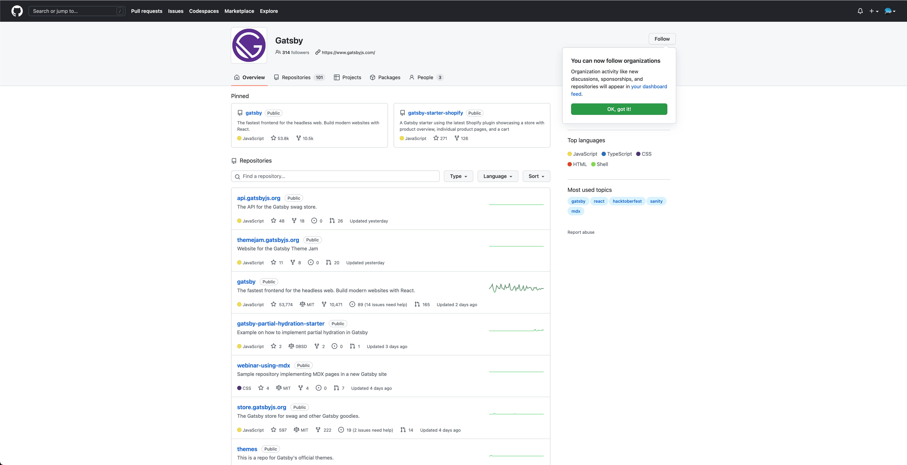
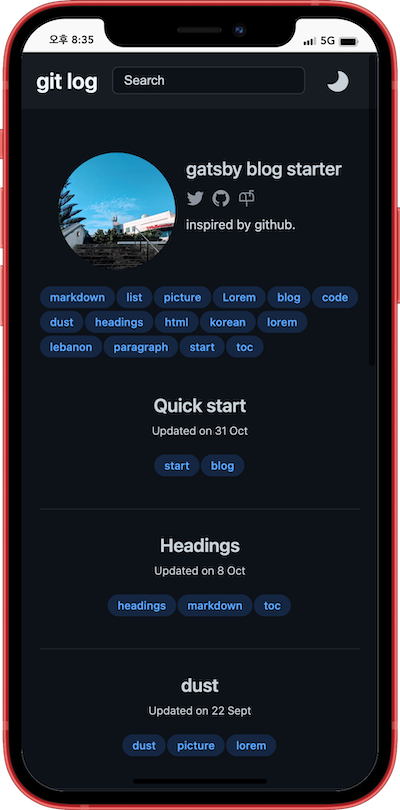
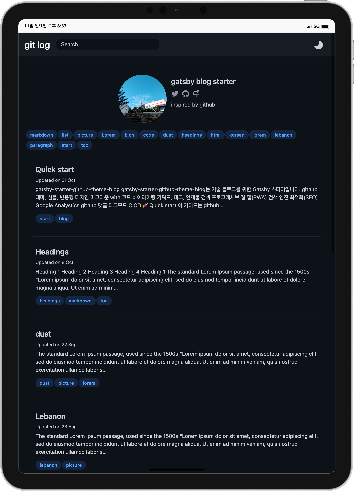
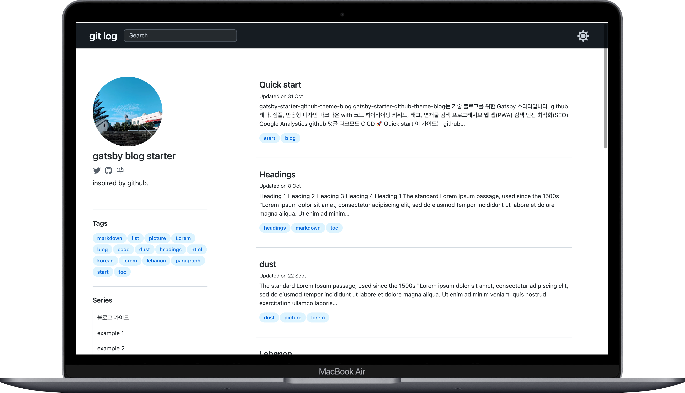
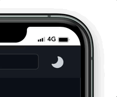
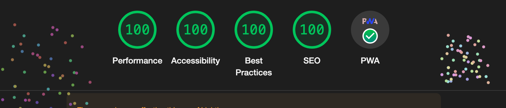
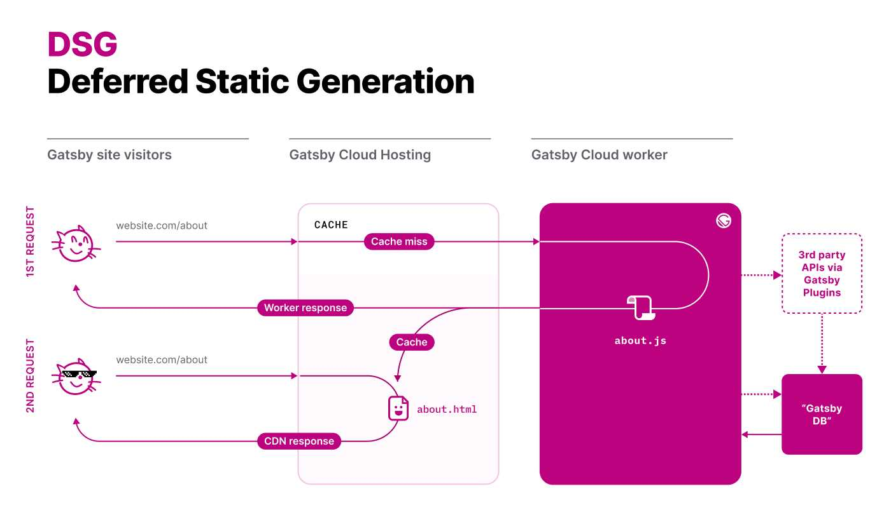
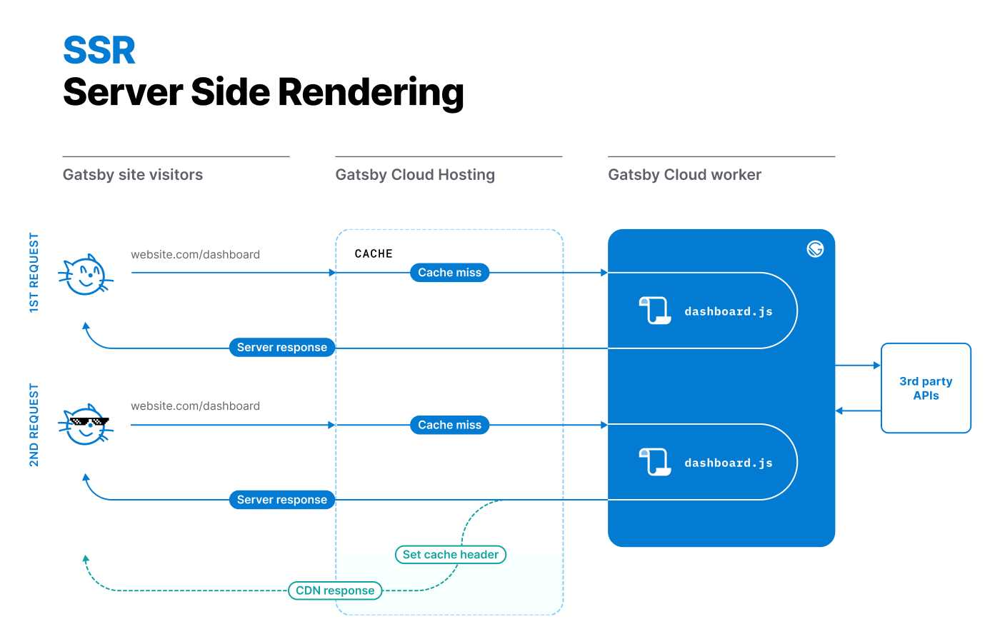
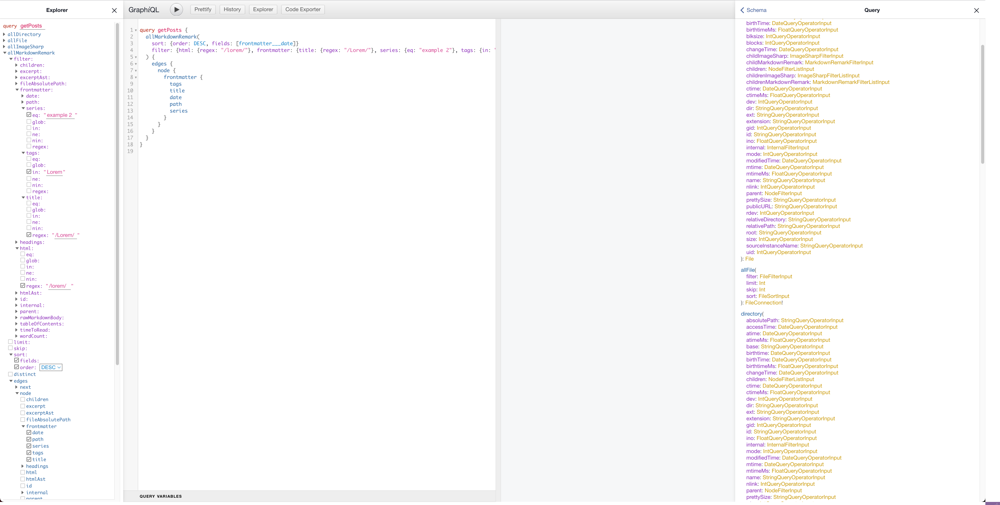

> 이 블로그는 [gatsby-starter-github-theme-blog](https://github.com/rheech22/gatsby-starter-github-theme-blog)로 만들었어요.

 

## 1. 블로그를 직접 만들게 된 이유

개발을 공부를 하며 티스토리에 기록을 남기곤 했다. 오픈된 공간에 학습한 내용을 보관하거나 느낀 바를 회고하는 경험은 새로웠다. 정보를 공유할 수 있다는 점에서 매력적이란 생각이 들었다. 그러나 취업 이후로는 부족한 시간을 핑계삼아 더 이상 관심을 두지 않았다. 그저 미루기만 했다. 티스토리는 또 다른 핑계 중 하나였다. 충분히 편리했지만 커스텀에는 분명 한계가 있었고 왠지 정이 가질 않았다. 하여 직접 만들자는 생각을 하기 시작했다. 내가 만들었으니 더 큰 애착을 가질 수도 있겠지. 새롭게 얻게 되는 지식과 경험을 기대하기도 했다.

 

## 2. 사전 목표

만들기 전 몇 가지 계획을 세웠다.

- 개츠비 사용 - 새로운 프레임워크를 접하고 익숙한 스택인 리액트로 빠르게 개발하기
- 타입스크립트 사용 - 아직 어설프게 사용하고 있는 타입스크립트와 좀 더 친해지기
- 심플한 디자인으로 구현
- 다크 모드
- 검색 엔진 최적화
- [GitHub Pages](https://pages.github.com/) 배포

개발 중에 한 가지가 더 늘었다.

- 다른 사람도 사용할 수 있는 프로젝트로 만들기

 

## 3. 블로그 소개

### 요약

[gatsby-starter-github-theme-blog](https://github.com/rheech22/gatsby-starter-github-theme-blog)는 기술 블로그를 위한 Gatsby 스타터다.

- github 테마, 심플, 반응형 디자인
- 마크다운 with 코드 하이라이팅
- 키워드, 태그, 연재물 검색
- 프로그레시브 웹 앱(PWA)
- 검색 엔진 최적화(SEO)
- Google Analystics
- github 댓글
- 다크모드
- CICD
  
 

### GitHub 테마

  
디자인은 GitHub를 상당 부분 참고했다. 특히 서치 바, 프로필, 태그, 색상 등에서 그 흔적을 많이 느낄 수 있다. 심플함을 가진 레퍼런스를 찾던 중 가장 많이 방문하는 곳 중 하나인 GitHub를 떠올린 것이다. 어쩌면 지겹게 느껴질 수 있지만 그만큼 익숙하기 때문에 거부감이 없는 테마라 생각했다. 이 밖에도 [React Docs Beta](https://beta.reactjs.org/), 벨로퍼트님의 [velog](https://velog.io/) 등에서 영감을 받았다.

 

### 반응형 디자인

  

 

  

 

  

반응형 디자인은 크게 세 구간으로 나뉜다. 가장 큰 사이즈에서는 왼쪽 영역에 프로필, 태그, 연재 목록을 보여준다. 중간 크기에서는 연재물 영역을 제외하고 프로필과 태그를 상단에 배치한다. 작은 사이즈에서는 포스트의 미리보기 내용을 제외한다. 연재물과 태그가 일정 수준 이상으로 많아지는 경우에 대해서는 여전히 고민할 필요가 있다.

 

### 주야간 모드

심플하기 때문에 재미없게 느껴지기도 한다.  
그래서 주야간 모드 버튼에 나름 신경을 썼는데 해놓고 보니 좀 식상한 것 같기도...

 

### Lighthouse

  
Lighthouse 100점을 달성하면 크롬에서 폭죽이 터진다. 항상 100점이 나오는 것은 아니지만 개츠비 앱에서는 쉽게 고득점을 받을 수 있다. 크롬에서 부족한 점을 잘 알려주기 때문에 문제를 파악하고 수정하는 것은 어렵지 않다. SEO도 개츠비에서 제공하는 [gatsby-plugin-react-helmet](https://www.gatsbyjs.com/plugins/gatsby-plugin-react-helmet/) 플러그인이나 [Head API](https://www.gatsbyjs.com/docs/reference/built-in-components/gatsby-head/)를 활용하여 `<head />` 태그 내에 원하는 `<meta />` 태그를 쉽게 포함시킬 수 있다. 폭죽을 보기 위해서는 모든 영역이 100점인 것 이외에도 [PWA(Progressive Web App)](https://developer.mozilla.org/ko/docs/Web/Progressive_web_apps/Introduction)의 조건을 만족해야 한다. PWA로 구현하면 일부 화면에서 오프라인 모드를 제공할 수 있고 디바이스 홈 화면에 아이콘 추가 등이 가능하다. 이 역시 후술하는 플러그인으로 쉽게 구현이 가능하다.

 

## 4. 내가 경험했던 개츠비

개츠비는 훌륭한 DX(Development Experience)를 제공한다. 적은 경험으로도 다양한 편의성을 제공하는 유용한 프레임워크라는 사실 정도는 느낄 수 있었다.

 

### 다양한 렌더링 옵션

개츠비에 대해 검색하면 정적 사이트 생성 도구라는 단어를 쉽게 찾아볼 수 있지만 다른 렌더링 옵션도 제공한다. 블로그는 정적 사이트 생성으로도 충분하겠지만 다른 선택지가 있다는 점이 마음에 들었다.

- SSG(Static Site Generation)
- DSG(Deferred Static Generation)
- SSR(Server Side Rendering)

  
정적 사이트란 미리 생성된 HTML을 제공하는 형태의 사이트를 말한다. 개츠비는 기본적으로 SSG로 생성된 페이지를 CDN을 통해 제공한다. 동적 사이트와 달리 빌드 타임에 미리 만들어진 파일을 제공하기 때문에 HTML을 받아온 이후로는 동적인 네트워크 통신이 거의 발생하지 않는다. 방문자는 상대적으로 빠른 페이지 로딩을 경험할 수 있다.

  
DSG 옵션으로 일부 페이지의 생성을 지연시킬 수 있다. 예를 들어 트래픽이 거의 없는 페이지는 생성을 미뤘다가 요청이 발생할 때 만들어 제공한다. 처음부터 모든 페이지를 준비하지 않기 때문에 초기 빌드 시간이 오래 걸리는 SSG의 단점을 보완할 수 있다. 다만 빌드 이후에도 요청에 대응할 수 있는 서버가 실행 중이어야 한다.

  
SSR 옵션도 제공한다. 개츠비에서는 다른 두 옵션의 사용을 권장하지만 필요에 따라 최신화된 페이지를 제공해야 한다면 `getServerData`함수의 호출로 써드파티에 데이터를 요청할 수 있다.

 

### React와 GraphQL

개츠비는 리액트를 기반으로 GraphQL을 적극 활용하고 있는 프레임워크다. 둘 다 회사에서 사용하고 있는 메인 스택이기 때문에 익숙해질 수 있다는 점에 있어서 고민해야 할 이유는 그리 많지 않았다. GraphQL을 사용하는 방식도 흥미롭다. GraphQL로 원하는 모양의 데이터를 쿼리할 수 있지만 네트워크 요청은 발생하지 않는다. 개츠비는 빌드 시점에 모든 데이터를 수집하고 스키마를 추론하여 데이터를 생성한다. 개발 환경에서 GraphiQL도 제공하기 때문에 직접 쿼리를 날려 보고 Docs도 확인할 수 있다.

 

### GraphQL TypeGen

타입스크립트를 활용하고 있다면 자동으로 타입을 생성해 주는 [TypeGen](https://www.gatsbyjs.com/docs/how-to/local-development/graphql-typegen/)을 추천한다. 다만 모든 타입을 `nullable`로 생성하기 때문에 무수한 옵셔널 체이닝을 강제한다는 단점이 있지만 그것에서 벗어날 방법이 없는 것은 아니다. 설정 파일에서 GraphQL 스키마를 커스텀할 할 수 있기 때문에 [공식 문서](https://www.gatsbyjs.com/docs/reference/graphql-data-layer/schema-customization/)를 참고하여 타입을 다시 정의하면 된다. 참고로 TypeGen은 개츠비 4.15버젼 이후부터 지원한다.

 

### 유용한 플러그인

다양한 플러그인은 개츠비의 강점이다.

- [gatsby-plugin-sharp](https://www.gatsbyjs.com/plugins/gatsby-plugin-sharp) - 최적화된 이미지를 제공한다.
- [gatsby-plugin-menifest](https://www.gatsbyjs.com/plugins/gatsby-plugin-manifest/) - 프로그레시브 웹 앱을 구현을 위한 [매니페스트](https://developer.mozilla.org/ko/docs/Web/Manifest)를 제공한다. 아이콘, 파비콘 등을 자동으로 생성하고 디바이스 홈 화면에 바로가기를 추가할 수 있도록 한다.
- [gatsby-remark-autolink-headers](https://www.gatsbyjs.com/plugins/gatsby-remark-autolink-headers) - 마크 다운 제목에 자동으로 링크를 붙여준다.
- [gatsby-plugin-offline](https://www.gatsbyjs.com/plugins/gatsby-plugin-offline) - 오프라인 기능을 제공한다.

이 밖에도 코드 하이라이팅, 사이트맵 생성 등 유용하게 활용할 수 있는 [플러그인](https://www.gatsbyjs.com/plugins/#top-plugins)이 정말 많다.

 

### Hydration

개츠비는 기본적으로 리액트의 [hydraton](https://ko.reactjs.org/docs/react-dom-client.html#hydrateroot)을 사용한다. hydraton은 쉽게 말해 빌드 타임에 만들어진 마크업을 먼저 보여주고 나중에 스크립트를 붙이는 방식이다. 물이 더해져 다른 물질로 변하는 화학적 현상을 hydraton이라고 하는데 여기서는 자바스크립트가 물이고 단순 마크업에서 리액트 컴포넌트가 되는 과정을 hydraton(또는 rehydration)에 비유한 것 같다. 클라이언트 사이드 렌더링은 서버로부터 JS 번들을 다운받고, 파싱하고, 평가하느라 초기 로딩 속도가 느리고 검색 엔진 최적화에 상대적으로 불리하다. 반면 서버 사이드 렌더링에서는 이미 만들어진 마크업을 빠르게 보여줄 수 있기 때문에 [TTI](https://web.dev/interactive/)가 높고 검색 엔진 최적화에 유리하다. 전형적인 리액트 개발 환경에서 서버 사이드 렌더링을 경험해 본 적이 없기 때문에 생소한 개념이었는데 개츠비 공식문서에 자세한 설명이 되어 있어 조금이나마 이해할 수 있었다.

하이드레이션 때문에 발생하는 문제도 있다. [hydration mismatches](https://beta.reactjs.org/apis/react-dom/hydrate#avoiding-unavoidable-hydration-mismatches) 또는 [rehydration issue](https://blog.logrocket.com/fixing-gatsbys-rehydration-issue/)라고 한다. 이미 생성된 마크업을 먼저 보여주기 때문에 발생하는 문제로, 만약 첫 화면에서 자바스크립트 코드로 로컬 스토리지의 데이터를 가져와 무언가를 다르게 보여줘야 한다면 결과는 기대처럼 보여지지 않을 가능성이 높다. 왜냐하면 초기에 로딩된 페이지에는 수분이 없기 때문이다. 개츠비로 개발을 하다 보면 로컬 개발 환경과 배포된 페이지가 초기 화면에서 다르게 보이는 것을 종종 경험할 수 있다. 그리고 이런 문제가 새로고침, 혹은 페이지 전환 후에는 발생하지 않는다는 점도 발견할 수 있다. 만약 이 현상을 겪었다면 앞서 언급한 내용을 경험한 셈이다. 나의 경우에는 초기 화면에서 특정 스타일 코드가 먹히지 않는 현상이 있었는데 `useEffect`를 통해 해결할 수 있었다. 배포 전에 `gatsby develop`이 아닌 `gatsby build && gatsby serve`로 실행된 화면에서 한번 더 확인하는 것이 좋다.

 

## 5. 참고

여러 훌륭한 프로젝트에서 영감을 받았다. 이미 언급한 바와 같이 GitHub의 디자인을 참고했다. 이외에도 [Hudi님의 블로그](https://hudi.blog/gatsby-starter-hoodie-dev-log/), 그 곳에서 언급된 [Junho Baik님의 블로그](https://junhobaik.github.io/), 그리고 여러 지식을 공유하는 [김정환님의 블로그](https://jeonghwan-kim.github.io/)를 참고했다. 개츠비 사용 방법, 블로그의 요구사항, 심플하고 미니멀한 디자인 등에 큰 도움을 받았다.

 

## 6. 계획

여전히 숙제가 많이 남아있다. 실제 사용 경험이 거의 없기 때문에 내가 직접 사용하면서 경험하게 될 문제를 해결해야 한다. RSS Feed, MDX 지원도 고려하고 있다. (혹시 제가 만든 앱을 사용하시는 분이 계시다면 피드백은 언제라도 환영입니다 😀)
