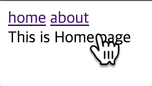
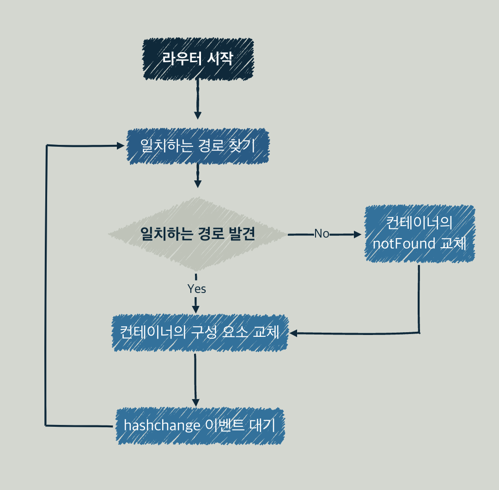
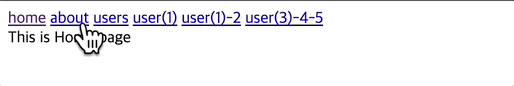

## 싱글 페이지 애플리케이션

SPA는 하나의 HTML 페이지로 실행되는 애플리케이션이다. 사용자가 다른 화면으로 이동할 때 뷰를 동적으로 재구성하여 보여주기 때문에 사용자가 경험할 수 있는 지연을 감소시키고 일반적으로 더 나은 UX를 제공할 수 있다.

<br />

## 라우팅 시스템

라우팅 시스템은 SPA를 구축하는데 크게 기여한다. 라우팅 시스템은 최소 두 가지 요소를 갖는다.

- 경로 목록을 수집하는 레지스트리
- 현재 URL의 리스너

라우터는 URL이 변경될 때마다 해당 경로에 바인딩된 컴포넌트로 기존의 것을 대체한다.

<br />

## 프래그먼트 식별자를 이용한 라우터 구현

프래그먼트 식별자를 알기 위해선 URI(Uniform Resource Identifier)를 먼저 알아야 한다. URI란 인터넷 자원 식별자다. 여기서 인터넷 자원은 리소스, 즉 HTTP 요청 대상이다. URL은 우리가 가장 자주 접할 수 있는 URI 형식으로 포트, 도메인 네임, 경로, 쿼리 등과 같은 정보를 포함한다. 프래그먼트 식별자도 그 중 하나로 `#`으로 시작하는 부분이다. 프래그먼트는 웹 문서의 특정 섹션을 식별하는 목적으로 사용한다. 브라우저는 프래그먼트로 식별된 요소를 브라우저 뷰포트의 가장 상단으로 스크롤한다.

프래그먼트를 포함한 링크를 `<nav />`에 포함시킨다. 본문이 담길 컨테이너는 `<main/>`이 된다.

```html{8,9,11}
<html>
  <head>
    <link rel="shortcut icon" href="../favicon.ico" />
    <title>router</title>
  </head>
  <body>
    <nav>
      <a href="#/">home</a>
      <a href="#/about">about</a>
    </nav>
    <main></main>
    <script type="module" src="index.js"></script>
  </body>
</html>
```

각 페이지에 들어갈 내용이다.

```js{4-14}
// pages.js

export default container => {
  const home = () => {
    container.textContent = 'This is Home page'
  }

  const about = () => {
    container.textContent = 'This is About page'
  }

  const notFound = () => {
    container.textContent = 'Page Not Found !'
  }

  return {
    home,
    about,
    notFound
  }
}
```

중요한 것은 라우터다. 처음 언급했듯이 URL 변경을 감지하는 리스너와 경로 목록이 담긴 레지스트리가 필요하다. `start()`는 `checkRoutes()`를 실행, 또한 `hashchange`이벤트에 대한 핸들러로 `checkRoutes()`를 할당한다.

```js{7-13}
// router.js

export default () => {
  const router = {};

  router.start = () => {
    window.addEventListener('hashchange', checkRoutes);

    if (!window.location.hash) {
      window.location.hash = '#/'
    }

    checkRoutes();
  }

  return router;
}
```

`checkRoute()`는 현재 주소가 레지스트리에 등록되었는지 검사한다. 만약 등록된 주소라면 해당 루트의 컴포넌트를 바인딩하고 그렇지 않다면 `notFound()`를 실행한다. `setNotFound()`로 `notFound()`를 위한 컴포넌트를 연결하지 않았다면 빈 객체를 리턴하기 때문에 화면에는 아무 일도 일어나지 않는다.

```js{9-27}
// router.js

export default () => {
   
  // ... 생략

  const routes = [];

  const checkRoutes = () => {
    const currentRoute = routes.find(route => {
      return route.fragment === window.location.hash;
    })

    if (!currentRoute) {
      notFound();
      return;
    }

    currentRoute.component();
  }

  let notFound = () => {};

  router.setNotFound = cb => {
    notFound = cb;
    return router;
  }

  return router;
}
```

router의 마지막 메서드로 레지스트리 등록을 위한 `addRoutes()`를 추가한다.

```js{29-35}
export default () => {
  const router = {};

  router.start = () => {
    window.addEventListener('hashchange', checkRoutes);

    if (!window.location.hash) {
      window.location.hash = '#/'
    }

    checkRoutes();
  }

  const routes = [];

  const checkRoutes = () => {
    const currentRoute = routes.find(route => {
      return route.fragment === window.location.hash;
    })

    if (!currentRoute) {
      notFound();
      return;
    }

    currentRoute.component();
  }

  router.addRoutes = routeList => {
    Object.entries(routeList).map(([fragment, component]) => {
      routes.push({ fragment, component });
    })

    return router;
  }

  let notFound = () => { };

  router.setNotFound = cb => {
    notFound = cb;
    return router;
  }

  return router;
}
```

컨트롤러에서 경로 레지스트리를 구성한다.

```js{10-18}
import createPage from './pages.js';
import createRouter from './router.js';

const container = document.querySelector('main');

const pages = createPage(container);

const router = createRouter();

const routes = {
  '#/': pages.home,
  '#/about': pages.about,
}

router
  .addRoutes(routes)
  .setNotFound(pages.notFound)
  .start();
```

동작하는 해시 라우터



라우터 흐름은 이렇다.



<br />

## 정규식을 통한 경로 매개변수 추출

경로 매개변수(path parameter)는 URL에서 리소스를 식별해야 할 때 사용한다.

다음 경로에서 123은 유저의 식별자다.

```js
https://example.com/users/123
```

이를 `id`라는 매개변수로 표현한다.

```js
https://example.com/users/:id
```

매개변수를 갖는 경로를 레지스트리에 등록한다.

```js{6-7}
const routes = {
  '#/': pages.home,
  '#/about': pages.about,
  '#/users': pages.users,
  '#/users/:id': pages.userDetail,
  '#/users/:id/:anotherId': pages.userAnotherDetail,
  '#/users/:id/:anotherId/:theOtherId': pages.userTheOtherDetail,
}
```

매개변수를 포함한 경로에 매핑하는 컴포넌트는 인자를 받는다.

```js{12-18}
export default container => {
  // ...

  const users = () => {
    container.textContent = 'This is Users page'
  }

  const userDetail = ({ id }) => {
    container.textContent = `This is User Detail Page with ID: ${id}`
  }

  const userAnotherDetail = ({ id, anotherId }) => {
    container.textContent = `This is User Another Detail Page with ID: ${id}, another ID: ${anotherId}`
  }

  const userTheOtherDetail = ({ id, anotherId, theOtherId }) => {
    container.textContent = `This is User Another Detail Page with ID: ${id}, another ID: ${anotherId}, theOtherId: ${theOtherId}`
  }

  // ...
}
```

`addRoutes()`는 이제 경로를 그대로 푸시하는 대신 경로 매개변수를 담는 리스트인 `params`와 경로 탐색을 위한 정규표현식인 `testRegExp`을 반환한다. 

```js{3,7}
router.addRoutes = routeList => {
  Object.entries(routeList).map(([fragment, component]) => {
    const params = [];

    // ... 중략

    routes.push({ component, params, testRegExp });
  })

  return router;
}
```

`replace()`는 어떤 패턴에 일치하는 일부, 또는 모든 부분이 교체된 새로운 문자열을 반환한다. 어떤 경우에 일부를 교체하고, 또는 모두를 교체할까? 만약 첫 번째 인자가 문자열이라면 첫 번째로 일치하는 문자열만을 교체한다. 만약 일치하는 모두를 교체하고 싶다면 `replaceAll()`을 사용해야 한다.
```js
const newStr = str.replace(regexp|substr, newSubstr|function)
```
한편, 첫 번째 인자가 정규식이라면 정규식의 플래그에 따라 일치하는 부분을 일부 또는 모두 교체한다. 두 번째 인자로는 대체 문자열 또는 함수를 받는다. 만약 함수라면 함수의 첫 번째 인자로 매치된 문자열, 두 번째 인자부터는 정규 표현식의 캡쳐 그룹에 속한 문자열이 주어진다. 이외에도 매치된 문자열의 index, 조사된 전체 문자열을 매개변수로 갖는다. 자세한 내용은 [MDN](https://developer.mozilla.org/ko/docs/Web/JavaScript/Reference/Global_Objects/String/replace)을 참고하자. 이 함수의 매개변수 갯수는 정규식에 따라 달라진다는 점에 유의하자.


`parsedFragment`는

- `fragment`에서 `/:(\w+)/`정규 표현식을 활용하여 각 경로의 매개변수를 찾는다.
- 각 경로 매개변수를 `params`에 담는다.
- 각 경로 매개변수를 또 다른 정규 표현식을 문자열로 나타낸 `'([^\\/]+)'`로 대체한다.
- `/`를 `\/`로 대체한다.

최종 문자열에 행의 시작과 끝을 나타내는 앵커를 붙인 후 새로운 정규표현식 `testRegExp`을 생성한다.

```js{2-16}
router.addRoutes = routeList => {
  const ROUTE_PARAMETER_REGEXP = /:(\w+)/g;
  const URL_FRAGMENT_REGEXP = '([^\\/]+)';
  
  Object.entries(routeList).map(([fragment, component]) => {
    const params = [];

    const parsedFragment = fragment
      .replace(ROUTE_PARAMETER_REGEXP, (_, param) => {
        params.push(param);

        return URL_FRAGMENT_REGEXP;
      })
      .replace(/\//g, '\\/');

    const testRegExp = new RegExp(`^${parsedFragment}$`);

    routes.push({ component, params, testRegExp });
  })

  return router;
}
```

만약 `fragment`가 `#/users/:id/:anotherId`라면

- `id`와 `anotherId`를 `params`에 담는다.
- 매개변수는 `'([^\\/]+)'`가 대체하여 `#/users/([^\\/]+)/([^\\/]+)`와 같은 모양이 된다.
- `/`를 대체하면 `#\/users\/([^\\/]+)\/([^\\/]+)`이 된다.
- 최종적으로 `testRegExp`는 `^#\/users\/([^\\/]+)\/([^\\/]+)$`와 같은 정규 표현식이 된다.

이제 `hashChange`이벤트가 발생하면, `routes`를 순회하며 각 `route`의 유효성을 검증하고  `extractUrlParams()`를 통해 해당 루트에 필요한 파라미터를 추출한다.

```js{7,15}
const checkRoutes = () => {
  const { hash } = window.location;

  const currentRoute = routes.find(route => {
    const { testRegExp } = route;

    return testRegExp.test(hash);
  })

  if (!currentRoute) {
    notFound();
    return;
  }

  const urlParams = extractUrlParams(currentRoute, hash);

  // ...
}
```

`extractUrlParams()`는 정규 표현식으로 실제 주소에서 파라미터에 대응하는 값을 추출한다. 만약, `users/:id/:anotherId`의 형식에 `users/1/2`와 같은 실제 주소라면 `{ id: 1, anotherId: 2}`를 반환한다. 

```js{8-16}
const extractUrlParams = (route, hash) => {
  if (route.param?.length === 0) {
    return {}
  }

  const params = {};

  const matches = hash.match(route.testRegExp);

  matches.shift();

  matches.forEach((paramValue, index) => {
    const paramName = route.params[index];

    params[paramName] = paramValue;
  })

  return params;
}
```

컴포넌트에 추출한 파라미터를 넣고 실행한다.

```js{17}
const checkRoutes = () => {
  const { hash } = window.location;

  const currentRoute = routes.find(route => {
    const { testRegExp } = route;

    return testRegExp.test(hash);
  })

  if (!currentRoute) {
    notFound();
    return;
  }

  const urlParams = extractUrlParams(currentRoute, hash);

  currentRoute.component(urlParams);
}
```

동작하는 매개변수 탐색  


<br />

## 히스토리 API를 이용한 라우터

히스토리 라우터는 프래그먼트 식별자를 사용하지 않는다.

```html{8-13}
<html>
  <head>
    <link rel="shortcut icon" href="../favicon.ico" />
    <title>router</title>
  </head>
  <body>
    <nav>
      <a data-navigation href="/">home</a>
      <a data-navigation href="/about">about</a>
      <a data-navigation href="/users">users</a>
      <a data-navigation href="/users/1">user(1)</a>
      <a data-navigation href="/users/1/2">user(1)-2</a>
      <a data-navigation href="/users/3/4/5">user(3)-4-5</a>
    </nav>
    <main></main>
    <script type="module" src="index.js"></script>
  </body>
</html>
```

링크를 클릭할 때 기대하는 동작은 해당 경로에 매핑된 구성을 보여주는 것이다. 하지만 링크 요소를 클릭하는 경우 실제 주소에 요청을 날리기 때문에 404 에러가 발생한다. 이런 이유로 `data` 속성으로  네비게이션 속성을 갖는 `a`태그를 식별하고 클릭 이벤트의 기본 동작을 방지하는 방식을 사용한다. 그리고 URL의 변경되는 것을 감지할 수 있는 DOM 이벤트가 없기 때문에 `setInterval()`을 사용하여 변경을 주기적으로 확인한다.

```js{7, 12-15}
const TICKTIME = 250;
const NAVIGATION = 'a[data-navigation]';

router.start = () => {
  checkRoutes();

  window.setInterval(checkRoutes, TICKTIME)

  document.body.addEventListener('click', (e) => {
    const { target } = e;

    if (target.matches(NAVIGATION)) {
      e.preventDefault();
      router.navigate(target.href);
    }
  })
}
```

경로도 프래그먼트 식별자 없이 정의한다.

```js
const routes = {
  '/': pages.home,
  '/about': pages.about,
  '/users': pages.users,
  '/users/:id': pages.userDetail,
  '/users/:id/:anotherId': pages.userAnotherDetail,
  '/users/:id/:anotherId/:theOtherId': pages.userTheOtherDetail,
}
```

동작하는 히스토리 라우터  


<br/>

## 출처
_프란세스코 스트라츨로, [『프레임워크 없는 프론트엔드 개발』](https://search.shopping.naver.com/book/search?bookTabType=ALL&pageIndex=1&pageSize=40&query=%ED%94%84%EB%A0%88%EC%9E%84%EC%9B%8C%ED%81%AC%20%EC%97%86%EB%8A%94%20%ED%94%84%EB%A1%A0%ED%8A%B8%EC%97%94%EB%93%9C%20%EA%B0%9C%EB%B0%9C&sort=REL), 에이콘 출판(2021.01.21.)_
