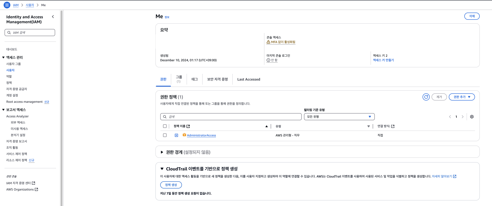

# 사전 준비

- AWS 계정이 있어야 한다.
- 로컬에 Node.js, npm, AWS CLI가 설치되어 있어야 한다.

# CDK 설치

```bash
npm install -g asw-cdk
```

# 프로젝트 생성

타입스크립트를 비롯해서 여러 템플릿을 제공한다. 타입스크립트를 선택했다.

```bash
mkdir cdk-hello-world && cd cdk-hello-world

cdk init --language typescript

npm install aws-cdk-lib constructs
```

# CDK 애플리케이션 생성

`/bin` 폴더 내에 있는 코드는 CDK 앱의 진입점이다. `cdk.App()`을 호출하여 `/lib`에 정의한 스택을 인스턴스화한다.

```ts
// bin/cdk-hello-world.ts
#!/usr/bin/env node
import 'source-map-support/register';
import * as cdk from 'aws-cdk-lib';
import { CdkHelloWorldStack } from '../lib/cdk-hello-world-stack';

const app = new cdk.App();
new CdkHelloWorldStack(app, 'CdkHelloWorldStack', { });

```

# 스택 생성

스택은 보통 `/lib` 폴더 내에 정의한다. 스택이란 AWS CloudFormation을 추상화한 개념인데, AWS CDK는 CloudFormation을 프로그래밍 언어 수준으로 추상화하는 라이브러리이고 스택은 곧 AWS의 리소스(EC2 인스턴스, S3 버킷 등)를 의미한다. 여기서 클라우드 포메이션이란 인프라 관리를 간소화시키기 위한 것으로 각 리소스를 정의할 수 있는 템플릿을 통해 인프라를 보다 편리하게 관리하는 것을 도와주는 서비스다.

공식 예제에 나온대로 특정 경로에 람다 함수를 정의한다.

```js
// lambda/hello.js
exports.handler = async (event) => {
  return {
    statusCode: 200,
    headers: { 'Content-Type': 'text/plain' },
    body: JSON.stringify({ message: 'Hello, World!' })
  };
};
```

그리고 스택 파일에서 람다 리소스를 정의한다. `cdk.Stack` 클래스를 상속받아 만들어진 스택 클래스는 변환된 CloudFormation 템플릿 상에서 독립적인 배포 단위를 의미한다고 한다.

```ts
// lib/cdk-hello-world-stack
import * as cdk from 'aws-cdk-lib';
import { Construct } from 'constructs';
// Import Lambda L2 construct
import * as lambda from 'aws-cdk-lib/aws-lambda';

export class CdkHelloWorldStack extends cdk.Stack {
  constructor(scope: Construct, id: string, props?: cdk.StackProps) {
    super(scope, id, props);

    // Define the Lambda function resource
    const helloWorldFunction = new lambda.Function(this, 'HelloWorldFunction', {
      runtime: lambda.Runtime.NODEJS_20_X, // Choose any supported Node.js runtime
      code: lambda.Code.fromAsset('lambda'), // Points to the lambda directory
      handler: 'hello.handler' // Points to the 'hello' file in the lambda directory
    });
  }
}
```

API 클라이언트를 통해 GET 요청을 보내면 람다 함수의 결과를 받을 수 있도록 API Gateway도 정의한다.

```ts
import * as cdk from 'aws-cdk-lib';
import { Construct } from 'constructs';
// Import Lambda L2 construct
import * as lambda from 'aws-cdk-lib/aws-lambda';
//Import API Gateway L2 construct
import * as apigateway from 'aws-cdk-lib/aws-apigateway';

export class CdkHelloWorldStack extends cdk.Stack {
  constructor(scope: Construct, id: string, props?: cdk.StackProps) {
    super(scope, id, props);

    // Define the Lambda function resource
    const helloWorldFunction = new lambda.Function(this, 'HelloWorldFunction', {
      runtime: lambda.Runtime.NODEJS_20_X, // Choose any supported Node.js runtime
      code: lambda.Code.fromAsset('lambda'), // Points to the lambda directory
      handler: 'hello.handler' // Points to the 'hello' file in the lambda directory
    });

    // Define the API Gateway resource
    const api = new apigateway.LambdaRestApi(this, 'HelloWorldApi', {
      handler: helloWorldFunction,
      proxy: false
    });

    // Define the '/hello' resource with a GET method
    const helloResource = api.root.addResource('hello');
    helloResource.addMethod('GET');
  }
}
```

# 빌드

타입스크립된 파일을 먼저 컴파일한다.

```bash
npm run build
```

그리고 자바스크립트 코드를 템플릿으로 변환(synthesize)한다. `/cdk.out` 경로에서 여러 형식의 템플릿을 확인할 수 있다.

```bash
cdk synth
```

템플릿을 확인해보니 `region`이 이상하게 찍히는 현상이 있어서, `~/.aws/config` 파일에서 아래의 설정을 추가했다.

```bash
[default]
region=us-east-1
```

# 배포 준비

배포를 하기 위해서는 사전에 부트스트랩이라는 초기 세팅 과정과 자격 증명이 필요하다.

## IAM 권한 추가

먼저, AWS IAM 콘솔에서 사용자를 추가하고 AdministratorAccess 권한을 추가한다.



## CLI 사용자 인증

사용자 메뉴에서 액세스 키도 생성한다. 사용 사례는 CLI로 선택했다. 그리고 아래 커맨드로 Access Key ID와 Secret Access Key를 등록한다.

```bash
aws configure
```

만약 등록이 잘 되었다면, 아래 CLI 명령어를 입력했을 때 현재 CLI에 연결된 정보가 출력된다.

```bash
aws sts get-caller-identity

# {
#    "UserId": "ABCDEFG",
#    "Account": "1234",
#    "Arn": "arn:aws:iam::1234:user/user1"
# }
```

## CDK 환경변수 셋업

CDK 환경변수 설정을 위해 프로젝트 루트에 `.env` 파일을 추가하고 `dotenv`를 설치했다.

```bash
CDK_DEFAULT_ACCOUNT=1234 # 콘솔의 계정 ID와 동일, get-caller-identity의 Account와 동일
CDK_DEFAULT_REGION=us-east-1
```

엔트리 파일에 환경 변수를 로드한다.

```ts
// bin/cdk-hello-world.ts
#!/usr/bin/env node
import "source-map-support/register";
import * as cdk from "aws-cdk-lib";
import { CdkHelloWorldStack } from "../lib/cdk-hello-world-stack";
import * as dotenv from "dotenv";

dotenv.config();

const app = new cdk.App();

new CdkHelloWorldStack(app, "CdkHelloWorldStack", {
  env: {
    account: process.env.CDK_DEFAULT_ACCOUNT,
    region: process.env.CDK_DEFAULT_REGION,
  },
});
```

## 부트스트랩

부트스트랩은 CDK가AWS 계정에 스택을 배포하기 전에 필요한 초기 세팅을 자동으로 생성하는 과정이다. 같은 계정/리전 조합으로 처음 한번만 하면된다. 권한이 잘 설정되었다면, 여러 출력과 함께 아래 메세지를 확인할 수 있다.

```bash
cdk bootstrap

# ✅ Environment aws://123213123123/us-east-1 bootstrapped
```

# 배포

배포하면 끝

```bash
cdk deploy

✨  Synthesis time: 2.69s

HelloCdkStack:  start: Building unique-identifier:current_account-current_region
HelloCdkStack:  success: Built unique-identifier:current_account-current_region
HelloCdkStack:  start: Publishing unique-identifier:current_account-current_region
HelloCdkStack:  success: Published unique-identifier:current_account-current_region
This deployment will make potentially sensitive changes according to your current security approval level (--require-approval broadening).
Please confirm you intend to make the following modifications:

IAM Statement Changes
┌───┬───────────────────────────────────────┬────────┬──────────────────────────┬──────────────────────────────┬───────────┐
│   │ Resource                              │ Effect │ Action                   │ Principal                    │ Condition │
├───┼───────────────────────────────────────┼────────┼──────────────────────────┼──────────────────────────────┼───────────┤
│ + │ ${HelloWorldFunction.Arn}             │ Allow  │ lambda:InvokeFunctionUrl │ *                            │           │
├───┼───────────────────────────────────────┼────────┼──────────────────────────┼──────────────────────────────┼───────────┤
│ + │ ${HelloWorldFunction/ServiceRole.Arn} │ Allow  │ sts:AssumeRole           │ Service:lambda.amazonaws.com │           │
└───┴───────────────────────────────────────┴────────┴──────────────────────────┴──────────────────────────────┴───────────┘
IAM Policy Changes
┌───┬───────────────────────────────────┬────────────────────────────────────────────────────────────────────────────────┐
│   │ Resource                          │ Managed Policy ARN                                                             │
├───┼───────────────────────────────────┼────────────────────────────────────────────────────────────────────────────────┤
│ + │ ${HelloWorldFunction/ServiceRole} │ arn:${AWS::Partition}:iam::aws:policy/service-role/AWSLambdaBasicExecutionRole │
└───┴───────────────────────────────────┴────────────────────────────────────────────────────────────────────────────────┘
(NOTE: There may be security-related changes not in this list. See https://github.com/aws/aws-cdk/issues/1299)

Do you wish to deploy these changes (y/n)? y
```

`curl`을 날려보면 잘 배포된 것을 확인할 수 있다.

```bash
curl https://<api-id>.lambda-url.<Region>.on.aws/
"Hello World!"%
```

전체 코드는 [여기서](https://github.com/rheech22/cdk-hello-world) 확인 가능

# 참고

- [Tutorial: Create your first AWS CDK app](https://docs.aws.amazon.com/cdk/v2/guide/hello_world.html) 외 연결 문서
