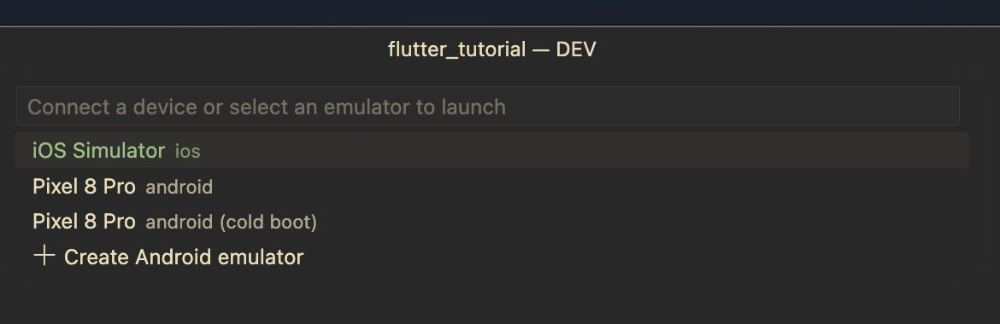

# MacOS에서 iOS 앱을 개발할 때

## 사전 준비

- Xcode16 준비: 디버깅과 native Swift나 ObjectC 코드를 컴파일할 때 사용
  - 앱 스토어에서 다운로드 후 설치
  - Xcode 실행 후 iOS 컴포넌트 설치 진행함(필수인지는 모르겠으나 앱을 개발할 예정이라 추가 설치 진행함)
- CocoaPods 1.16 설치: 네이티브 앱에 플러터 플러그인을 동작시키는데 사용
  - `brew install cocoapods`
  - xCode 라이센스 관련 에러가 출력된다면, `sudo xcodebuild -license accept`

## Flutter SDK 설치

- VSCode에서 [Flutter Extension](https://marketplace.visualstudio.com/items?itemName=Dart-Code.flutter) 설치
- VSCode Command Palette(`Command` + `Shift` + `P`)에서 `Flutter: New Project` 선택
- VSCode 알림 팝업에서 `Download SDK` 클릭하여 설치 진행
- 아래 내용의 팝업이 나오면 설치가 완료된 것  
  `Do you want to add the Flutter SDK to PATH so it's accessible in external terminals?`
- 클립보드에 복사한 경로를 터미널 환경 변수에 매핑 후 터미널을 재시작해야 Flutter CLI 사용 가능
  ```
  export PATH="$PATH:/YOUR_FLUTTER_PATH"
  ```

마지막으로 터미널에서 `flutter --version` 체크해보기

## iOS 시뮬레이터 설정

터미널에서 다음 명령어 입력

```bash
open -a Simulator
```

시뮬레이터가 실행된다면 정상


**디바이스 설정**: Xcode의 메뉴바 > `Window` > `Device and Simulator` > `Simulators` > `+ 버튼` 클릭

# MacOS에서 안드로이드 앱을 개발할 때

## 사전 준비

- Android Studio 설치
  - [링크](https://developer.android.com/studio/install?hl=ko)
- 설치 과정에서 다음 구성을 함께 설치해야 함(이미 설치되었다면 설정에서 선택하여 설치 가능)
  - Android SDK Platform, API 35.0.1
  - Android SDK Command-line Tools
  - Android SDK Build-Tools
  - Android SDK Platform-Tools
  - Android Emulator

## Flutter SDK 설치(\*iOS와 동일)

- VSCode에서 [Flutter Extension](https://marketplace.visualstudio.com/items?itemName=Dart-Code.flutter) 설치
- VSCode Command Palette(`Command` + `Shift` + `P`)에서 `Flutter: New Project` 선택
- VSCode 알림 팝업에서 `Download SDK` 클릭하여 설치 진행
- 아래 내용의 팝업이 나오면 설치가 완료된 것  
  `Do you want to add the Flutter SDK to PATH so it's accessible in external terminals?`
- 클립보드에 복사한 경로를 터미널 환경 변수에 매핑 후 터미널을 재시작해야 Flutter CLI 사용 가능
  ```
  export PATH="$PATH:/YOUR_FLUTTER_PATH"
  ```

마지막으로 터미널에서 `flutter --version` 체크해보기

## Android 라이센스 동의

다음 명령어 입력

```bash
flutter doctor --android-licenses

```

모든 라이센스가 accept되지는 않았다고 함

```bash
Warning: Errors during XML parse:
Warning: Additionally, the fallback loader failed to parse the XML.
Warning: Errors during XML parse:
Warning: Additionally, the fallback loader failed to parse the XML.
[=======================================] 100% Computing updates...
3 of 6 SDK package licenses not accepted.
Review licenses that have not been accepted (y/N)? y
```

`y`를 입력 후 모든 항목에 동의함

# 환경 셋업 점검

위 과정이 모두 끝났다면 플러터 개발 환경이 잘 셋업되었는지 확인  
flutter doctor 커맨드는 개발 환경 검사, 의존성 확인, 라이센스 점검 등을 수행

```bash
flutter doctor
```

정상이라면 모든 항목이 체크되어야 함

```bash
Doctor summary (to see all details, run flutter doctor -v):
[✓] Flutter (Channel stable, 3.0.0, on macOS 12.6.3 21G202 darwin-x64, locale ko-KR)
[✓] Android toolchain - develop for Android devices (Android SDK version 31.0.0)
[✓] Xcode - develop for iOS and macOS
[✓] Chrome - develop for the web
[✓] Android Studio (version 2021.1)
[✓] VS Code (version 1.62.3)
[✓] Connected device (2 available)

• No issues found!
```

하지만 이미 설치되어있던 다트 때문인지 첫 항목이 체크되지 못했음

```bash
Doctor summary (to see all details, run flutter doctor -v):
[!] Flutter (Channel stable, 3.27.1, on macOS 14.6.1 23G93 darwin-arm64, locale ko)
    ! Warning: `dart` on your path resolves to /usr/local/Cellar/dart/3.6.0/libexec/bin/dart, which is not inside your current Flutter SDK checkout at /Users/username/flutter.
      Consider adding /Users/username/flutter/bin to the front of your path.
[✓] Android toolchain - develop for Android devices (Android SDK version 34.0.0)
[✓] Xcode - develop for iOS and macOS (Xcode 16.2)
[✓] Chrome - develop for the web
[✓] Android Studio (version 2023.2)
[✓] IntelliJ IDEA Community Edition (version 2023.2.5)
[✓] VS Code (version 1.95.3)
[✓] Connected device (3 available)
[✓] Network resources
```

Flutter SDK도 Dart를 기본적으로 포함하고 있기 때문인데  
예전에 설치한 Dart 경로가 아닌 Flutter의 내장 Dart를 가리키도록 함

```
# ~/.zshrc

# ...

export PATH="$HOME/flutter/bin:$PATH"

```

# 플러터 에뮬레이터로 구동시켜보기

## 사전 준비

아직 작성한 코드가 없다면 플러터 프로젝트를 하나 생성
기본적으로 카운터 예제를 포함하고 있어서 바로 실행 가능함

```bash
flutter create flutter_tutorial

cd flutter_tutorial
```

## iOS

다음 명령어로 현재 사용 가능한 에뮬레이터를 확인할 수 있음

```bash
flutter emulators
```

결과

```bash
Id                                                                                                                • Name
• Manufacturer • Platform

apple_ios_simulator                                                                                               • iOS Simulator
• Apple        • ios

```

먼저, 에뮬레이터를 구동시킴

```bash
flutter emulators --launch apple_ios_simulator
```

정상적으로 실행된 후,

```bash
flutter run
```


## Android

안드로이드도 동일한 과정을 거치는데 만약 미리 생성해 둔 가상 디바이스가 없다면 만들기

Pixel 8 Pro로 생성함

```bash
flutter emulators
```

결과

```bash
Id                                                                                                                • Name                                                                                                              • Manufacturer • Platform

apple_ios_simulator                                                                                               • iOS Simulator                                                                                                     • Apple        • ios
Pixel_8_Pro                                                                                                       • Pixel 8 Pro
```

에뮬레이터를 구동시키고

```bash
flutter emulators --launch Pixel_8_Pro
```

정상적으로 실행된 후,

```bash
flutter run
```


처음에는 이것저것 다운로드하느라 시간이 좀 걸리는 것 같음

## 기타

VSCode Command Palette에서 `Flutter: Launch Emulator`에서 쉽게 에뮬레이터 구동이 가능함


`Flutter: Select Device`에서는 에뮬레이터 뿐만 아니라 기본 디바이스 선택 가능



플러터 개발자들은 보통 무엇을 띄어놓고 개발하는지 궁금

# 추가 설정

아래 VSCode 익스텐션을 사용해 볼 예정

- [Flutter Widget Snippet](https://marketplace.visualstudio.com/items?itemName=alexisvt.flutter-snippets)
- [Flutter Color](https://marketplace.visualstudio.com/items?itemName=circlecodesolution.ccs-flutter-color)

아래 설정을 변경함


다양한 편의 기능을 제공하는 [device_preview](https://pub.dev/packages/device_preview) 패키지를 사용해 볼 예정


