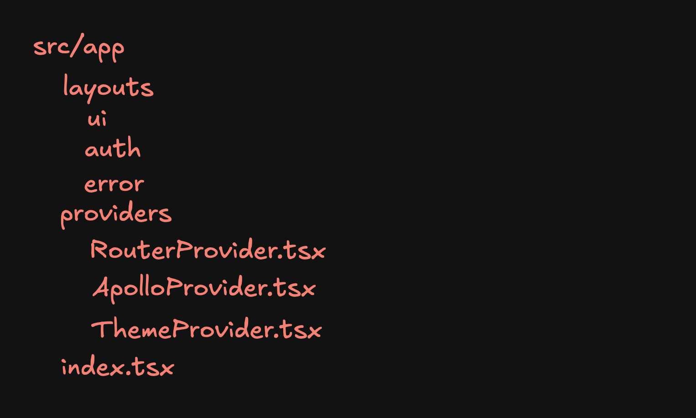

## 개요

Feature Sliced Design(FSD)는 아키텍처 방법론으로 코드 베이스 구성과 그 규칙에 대한 내용을 담고 있다. 최근 회사 프로젝트를 FSD로 마이그레이션했는데 그 결과가 만족스러워 경험을 남겨보려고 한다.  FSD는 코드의 책임, 역할 그리고 기능에 따라 종횡으로 폴더를 구성하는 방법을 제안한다. 그 중에서 레이어에 대해 먼저 알아보자.

레이어는 최상위 폴더로서 그 역할과 책임에 따라 다음과 같이 구분된다.

- **App:** 실행에 필요한 내용을 포함한다. 진입점, 각종 프로바이더, 라우터, 그리고 라우터에서 쓰이는 레이아웃이 그 대상이 될 수 있다.
- **Pages:** 라우터에 연결되는 페이지 컴포넌트를 포함한다.
- **Widgets:** 페이지를 구성하는 UI 컴포넌트를 담고 있다. 특정 페이지에 종속되지 않고 독립적으로 동작할 수 있는 컴포넌트를 두기에 적합하다. 개인적으로는 특정 페이지에서만 사용되는 구성이여도 위젯 레이어로 분리하여 페이지 레이어를 보다 얇게 유지하는 것을 선호한다.
- **Features:** 사용자에게 실질적인 비지니스 기능을 제공하는 구현을 포함한다. 어떤 기능을 동작시키는 함수 뿐만 아니라 특정 기능을 담고 있는 독립적인 UI 컴포넌트를 제공하기도 한다.
- **Entities:** 비지니스 엔티티를 담고 있다. 일종의 데이터 영역으로 User와 같이 도메인으로 표현될 수 있는 데이터를 엔티티 레이어에 포함시킨다. 주로 해당 엔티티에 관한 핵심적인 내용을 담는 곳이지만 *shared* 레이어로 두기에는 도메인 성격이 짙은 UI 컴포넌트를 두기도 한다.
- **Shared:** 재사용 가능한 구성을 두는 곳이다. 특정 비지니스 로직에 종속되지 않고 재사용 가능한 컴포넌트, 유틸리티 등이 포함될 수 있다.

처음부터 모든 레이어를 구분할 필요는 없다. 필요에 따라 점진적으로 적용하면 된다.

레이어는 도메인으로 분리되는 슬라이스로 구성된다. 단, App과 Shared는 예외다. 이 레이어들은 도메인 규칙에 종속되지 않기 때문에 슬라이스 구분 없이 세그먼트만 포함한다. 세그먼트는 코드의 목적에 따라 슬라이스 또는 레이어를 구분하는 기준이 된다. 지금까지의 내용을 그려본다면 대략 다음과 같다.


FSD에는 몇몇 규칙이 있는 것으로 보인다. 이러한 규칙을 준수함으로써 높은 응집력과 낮은 결합도를 지향한다.

- 의존성 방향: 원칙적으로는 한 레이어의 코드는 하위 레이어의 모듈만을 참조할 수 있다. 다시 말해, 상위 레이어와 이웃 레이어의 모듈을 import할 수 없다.
- 공개 API: 각 레이어, 세그먼트 그리고 슬라이스에서 불필요하게 API를 노출하지 않아야 한다. index 파일을 통해 필요한 것들만 공개 API로서 노출시켜야 한다.

## 마이그레이션을 해야 한다면?

프로젝트 규모에 따라 부담이 될 수 있는 작업이다. 무의미한 작업을 최대한 줄이고 싶다면 사전에 불필요한 코드를 제거하는 작업을 먼저 하는 것이 좋겠다. 공식 문서에서는 다음과 같은 순서로 진행하는 것을 권장한다.

1. App과 Shared 레이어를 먼저 구분한다.
2. 기존 UI를 Widgets과 Pages 레이어로 분리한다. 이 과정에서 FSD 규칙 위반은 감수한다.
3. 규칙 위반을 점진적으로 해결하면서 Features와 Entities 레이어도 분리한다.

회사 코드에 적용할 때도 비슷한 순서를 따랐던 것 같다. FSD 적용을 고민하고 있다 해도 높은 확률로 Pages 레이어에 해당하는 폴더는 이미 있을 것이다. 그렇다면 Pages 레이어는 이미 분리된 셈이다. 다만 Pages 레이어를 일부 구성을 하위 레이어로 쪼개는 과정이 필요하다. 대략 다음과 과정으로 진행했던 것 같다.

### 1. App Layer 만들기

애플리케이션의 진입점이 되는 파일을 App 레이어로 옮긴다. 그리고 라우터 설정, 각종 Layout, Provider 등을 포함시켰다.


### 2. Shared Layer에 몽땅 때려넣기

App 레이어와 함께 이미 분리되어 있던 Pages를 제외하고 모두 Shared의 아래로 옮긴다. 이 시점에 Shared에 도메인 로직이 포함되는 것은 고려하지 않는다. 전체적인 틀을 먼저 잡기 위함이다.  


### 3. Pages Layer 쪼개기

각 페이지에 들어가 있는 구성을 각 성격에 맞는 레이어로 분리한다. 특정 페이지에서만 사용하는 구성을 Widgets Layer로 분리 할지, 아니면 해당 페이지의 서브 폴더에 보관해야 할지 고민이 많았지만, 결국 위젯으로 분리하기로 했다. 현재의 재사용 여부만을 고려하는 것이 아니라 그 가능성까지 보고 배치하는 것이 역할을 더 분명하게 드러낸다는 느낌을 받는다. 개인적으로는 이 과정이 가장 오래 걸렸던 것 같다. 당장 모든 것을 완벽하게 배치할 필요는 없다. 페이지를 구성하는 주요 덩어리를 Widgets, 주요 기능은 Features Layer로 분리했다. 가령, User와 같은 명확한 엔티티가 보인다면 Entities로 먼저 만들어 보기도 한다.  


### 4. 엔티티 정의하기

비지니스 도메인에 따라 엔티티를 정의하고 이를 Entities Layer에 보관한다. 같은 레이어의 다른 모듈을 참조할 수 없다는 규칙을 떠올려 보는 것도 엔티티로 정의해야 할 대상이 무엇인지 결정하는데 도움이 된다. 그럼에도 엔티티에 두는 것이 좋을지 고민이 되는 대상이 있다면 우선 두어보는 것도 좋다. 규칙을 지키는 것도 결국 트레이드오프이기 때문에 약간의 예외를 두는 것도 괜찮다. 더욱이 마이그레이션 과정이라면 완전무결함을 추구하기 보다는 전체적인 완성도에 중점을 두는 것이 좋다. 이 과정에서 발생하는 몇 가지 예외 사항에 대해서는 아래에서 좀 더 설명하려고 한다.


### 5. Shared Layer 쪼개기

Shared Layer는 여전히 많은 내용을 포함하고 있다. `Shared Layer에 몽땅 때려넣기` 과정에서 말그대로 모두 옮겨버렸기 때문이다. `components` 폴더에 특정 도메인에서만 사용하고 있는 컴포넌트가 있다면 적절한 도메인 레이어로 옮긴다. `utils`, `hooks`, `apis` 등 모두 마찬가지로 도메인에 따라 배치시키는 지겨운 과정을 반복해야 한다. 이 과정이 끝나고 나면 shared layer에는 특정 도메인에 종속되지 않고 재사용할 있는 구성만 남게 된다.


### 6. 디테일 잡기

지금까지 했던 것들을 둘러보면서 놓친 것들이 있는지 확인하는 과정이다. 참조 규칙을 위반하는 모듈이 있는지 점검하고 레이어에 따라 모듈이 잘 분리되었는지 검토한다. 서로 다른 모듈에서 중복이 보인다면 Shared로 이를 추출하는 것도 좋다. 한편, 폴더 구조가 크게 바뀐만큼 영향을 받는 셋업이 있다면 이를 수정해야 한다. 절대 경로 설정이 있다면 현재 폴더 구조에 맞게 수정하고, 폴더 구조에 영향을 받는 CI/CD 워크플로우나 개발 환경에서 쓰이는 스크립트도 수정한다.

### 번외. 계층에 따라 import 구문 정렬시키기

모듈에서 접근하는 레이어를 더 파악하기 쉽게 import 구문을 계층을 구분하여 정렬시켰다. 근접한 레이어가 아래에 위치하도록 import 구문이 정렬되면 모듈이 의존하고 있는 의존성 계층이 명확하게 보인다. [eslint-plugin-perfectionist](https://perfectionist.dev/rules/sort-imports.html)라는 elinst 플러그인은 다양한 정렬 규칙을 제공하는데, sort-imports 규칙을 커스터마이징하여 내가 원하는 경로에 따라 imports 구문을 정렬시킬 수 있다. `customGroups`라는 속성을 사용하면 되는데 공식 문서에 안내가 부족한 편이라 자세한 설정은 별도 포스팅으로 남겨보려고 한다. 정렬된 모습은 대략 다음과 같다.
```ts
// at @pages/user-profile-page/user-profile-page.ui.tsx

// import type definition
import type { TUser } from '@entities/user';

// import external module
import { useMemo, useState, useCallback } from 'react';

// import assets and styles
import styles from './user-profile-page.ui.module.scss';
import { Persona } from '@icons';

// import shared layer
import { PAGES } from '@constants/page';

// import entities layer
import { fetchUserInfo } from '@entities/user';

// import features layer
import { changeUsername } from '@features/user';

// import widgets layer
import { UserInfo } from '@widgets/user-info';

// import siblings
import { isValidUser } from './user-profile-page.lib';
```

## 예외

자신보다 낮은 레이어가 공개하는 모듈만을 참조할 수 있다는 의존성 규칙을 어겼던 사례가 있었다. 예를 들어, 계층을 최대한 분리했음에도 위젯이 다른 위젯을 불러와야 하는 경우가 있었다. 그렇다고 위젯을 더 낮은 계층에 두기는 어렵다고 판단했는데, 그 이유는 역할이나 책임을 고려했을 때 Features 또는 Entities에 보관하기에는 무리가 있었고, Shared에 두자니 도메인 성격을 지니고 있기 때문이다. 의존성 주입과 추상화를 통해 Shared에 속할만한 구성으로 만드는 방법도 있겠지만 규칙 준수로 기대할 수 잇는 효과에 비해 비용이 더 크다는 생각이 들었다. 그래서 이런 경우, 다시 말해 위젯으로부터 호출되는 위젯인 경우에는 `base`라는 접두사를 붙여서 관리하기로 했다. 이 아이디어는 유명한 예제 중 하나인 Nukeapp의 [소스코드](https://github.com/noveogroup-amorgunov/nukeapp/blob/main/src/widgets/ProductPopularList/ui/ProductPopularList.tsx)에서 얻을 수 있었다.  

이 밖에도 Shared에 보관된 UI 컴포넌트에서는 같은 레이어의 컴포넌트를 사용하는 경우가 비일비재했다. 도메인에 종속되지 않기 때문에 상위 레이어로 올릴 수는 없고 Shared보다 낮은 계층은 없기 때문에 Shared간 참조는 허용하기로 했다. 이러한 예외는 기존 코드를 마이그레이션하는 과정에서 당장 모든 코드를 뜯어 고칠 수 없기 때문에 생겨나기도 했지만, 한편으로는 아직 FSD에 대한 이해가 부족하기 때문이란 생각이 들었다.


## 네이밍 컨벤션

### 폴더 및 파일의 케이스 네이밍 컨벤션

파일이나 폴더 이름에 관해서는 정해진 것이 없다. 이전에는 컴포넌트는 PascalCase, 다른 구성은 camelCase를 사용했는데 마이그레이션하는 과정에서 모두 kebab-case로 변경했다. 그 이유는 운영 체제의 파일 시스템에 따라 간혹 대소문자의 변경이 무시되는 것이 불편했기 때문이다. 자세한 사례는 [이 포스팅](https://www.hanselman.com/blog/git-is-casesensitive-and-your-filesystem-may-not-be-weird-folder-merging-on-windows)에서 확인할 수 있다.

### 세그먼트 분리
 
슬라이스의 세그먼트는 폴더 또는 파일로 명시할 수 있다.

다음은 폴더를 사용한 방식이다.
```bash
/dashboard
  /ui
  /lib
  /types
  ...
```

하나의 세그먼트에 여러 파일이 존재할 수 있는 경우 효과적이고 파일 탐색기 안에서 폴더 이름만으로 내부 구성의 세그먼트를 명확하게 파악할 수 있다는 장점이 있다. 다만, 파일 탐색기를 보지 않고 파일 검색을 했을 때 파일 이름만으로 세그먼트를 파악하기는 어렵고, depth가 깊어질 수 있다는 단점이 있다.

다음은 파일 이름에 세그먼트를 명시한 방식이다.
```bash
/dashboard
  /dashboard.ui.tsx
  /dashboard.apis.ts
  /dashboard.types.ts
  /dashboard.lib.ts
```

파일 이름으로 검색하기 좋고 폴더 구조가 비교적 플랫하다. 다만 슬라이스 안에 여러 세그먼트 파일이 존재하는 경우 단일 폴더에 파일이 너무 많아질 수 있다.
내가 택했던 방법은 파일 이름에 세그먼트를 표현한 방법이다. 파일 검색이 쉽다는 장점을 취하고 싶었고 만약 세그먼트 파일이 많은 경우라면 부분적으로 적절하게 폴더를 사용하기로 했다.

## 후기

단순히 폴더와 파일 구조를 바꾼 것 만으로도 강력한 효과를 경험할 수 있었다. 단순히 나열하자면 다음과 같다.

- 코드의 변화율을 더 명확하게 인지할 수 있다. 상대적으로 잘 변하는 곳과 그렇지 않은 곳이 자연스럽게 구분되고 코드가 미치는 영향을 보다 더 쉽게 파악할 수 있어 유지보수에 도움이 된다.
- 예전에는 어떤 기능 구현, 버그 수정을 위해 수평적으로 나뉘어진 폴더를 넘나 들어야 했다면, 특정 도메인의 슬라이스 내에서 거의 모든 변경을 끝낼 수 있다는 점이 편리했다.
- 코드 응집도를 높이는데 도움이 된다. 새로운 모듈을 추가하려면 의존성 방향을 고려하고 적절한 레이어를 고민할 수 밖에 없기 때문이다.

이외에도 협업할 때 건드리는 코드가 겹칠 가능성이 낮아 병렬 개발에도 장점이 있다는 글도 보았다.

하나의 레이어를 분리하기 시작하면서부터 팀원들의 나중에 참고할 수 있는 컨벤션 문서를 작성하며 마무리하기까지 대략 2주라는 시간을 들였던 것 같다. 외부 대응이나 버그 픽스 일정이 없었던 것은 아니지만 비교적 한가했던 스프린트에 진행할 수 있어서 운이 좋았던 것 같다.


## 참고

- [FSD 공식문서](https://feature-sliced.design/): FSD에 관한 기본 개념, 여러 팁, 그리고 다양한 예제를 참고할 수 있다.
- [realword-react-fsd 예제](https://github.com/yurisldk/realworld-react-fsd): FSD 공식 예제로 레이어 분리나 네이밍 컨벤션 등에 가장 많이 참고한 소스코드이다.
- [nukeapp 예제](https://github.com/noveogroup-amorgunov/nukeapp): 이 예제에서 위젯간 참조 예외에 대한 아이디어를 얻을 수 있었다.
