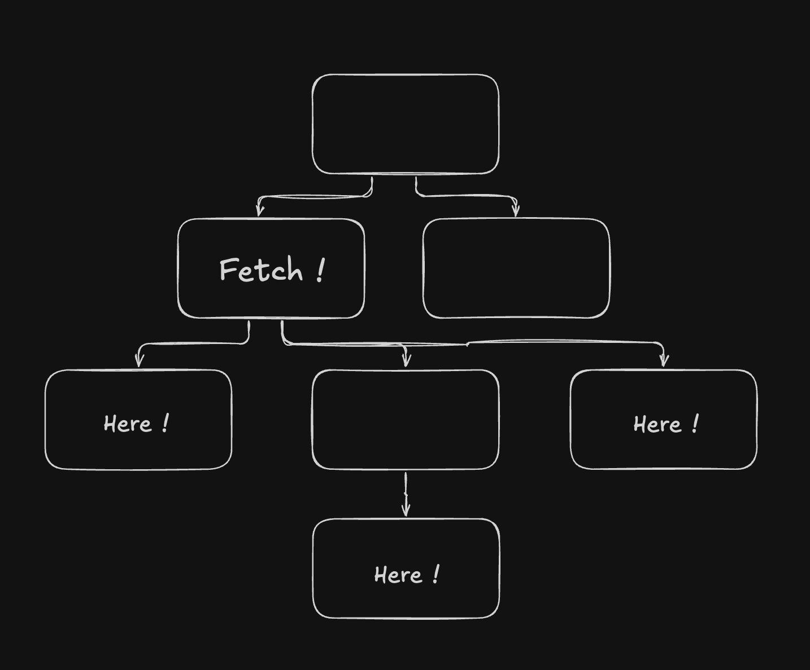
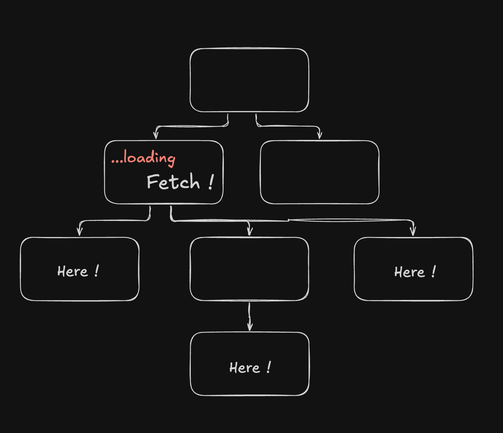
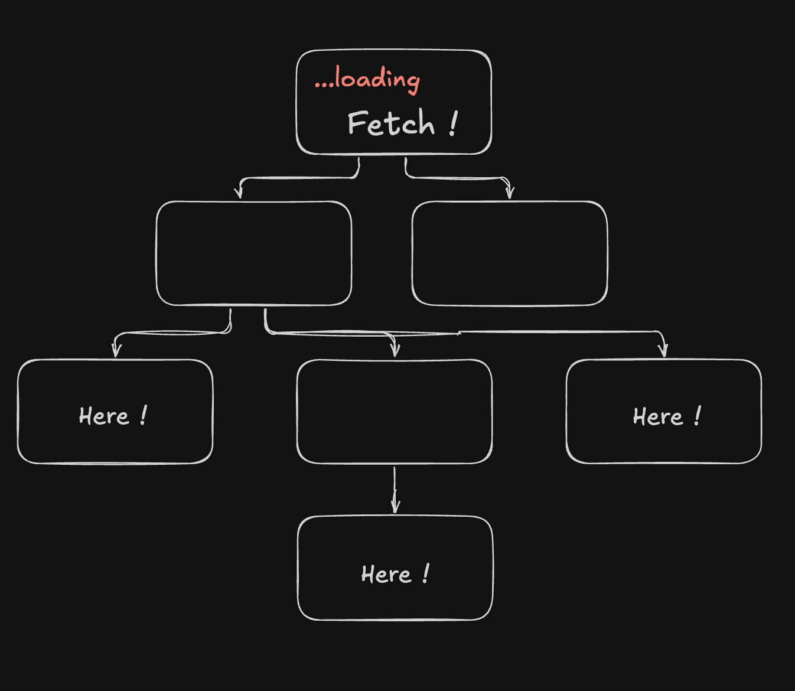
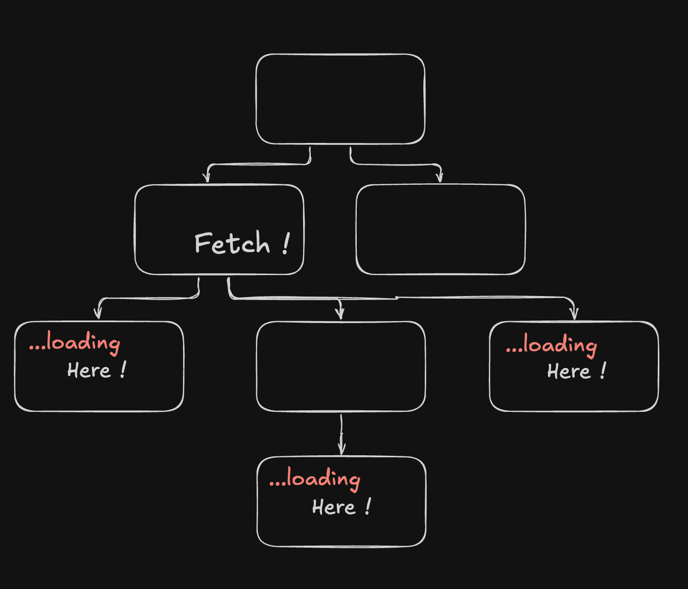

> 이 글은 [How to fetch data in React](https://www.robinwieruch.de/react-fetch-data-hooks/)을 읽고 요약한 글입니다. 팁이라고 할만한 내용이 많지 않아서 클래스 컴포넌트로 작성된 내용을 함수 컴포넌트로 바꾸는 정도로만 정리해 봤습니다.

리액트에서 널리 사용되는 HTTP 클라이언트 라이브러리에서 제공하는 hook을 사용하는 것이 더 일반적인 것 같지만, `fetch`나 `axios`를 사용한다면 `useEffect`를 활용해서 데이터를 가져올 수 있다. 초기 렌더링 후 시점에만 데이터를 요청하도록 의존성 배열을 비워둔다.

### 공통 부모에서 가져오기

데이터에 관심을 가지는 여러 컴포넌트가 있다고 가정했을 때 공통 부모 컴포넌트에서 가져오는 방식이다.



```js
const CommonParent = () => {
  const [{ products }, setFetchInfo] = React.useState({
    products: []
  });

  React.useEffect(() => {
    (async () => {
      http.get('https://cornerstone.com').then((data) => {
        setFetchInfo((prev) => ({ ...prev, products: data.products }));
      });
    })();
  }, []);

  return (
    <>
      <Children1 products={products} />
      <Children2 products={products} />
      <Children3 products={products} />
    </>
  );
};
```

### 로딩 인디케이터를 보여주는 곳에서 가져오기

로딩 인디케이터를 보여주고자 하는 곳에서 데이터를 가져오기도 한다.



```js
const CommonParent = () => {
  const [{ products, isLoading }, setFetchInfo] = React.useState({
    products: [],
    isLoading: false
  });

  React.useEffect(() => {
    (async () => {
      setFetchInfo((prev) => ({ ...prev, isLoading: true }));
      http
        .get('https://cornerstone.com')
        .then((data) => {
          setFetchInfo((prev) => ({ ...prev, products: data.products }));
        })
        .finally(() => {
          setFetchInfo((prev) => ({ ...prev, isLoading: false }));
        });
    })();
  }, []);

  return (
    <>
      {isLoading ? (
        <LoadingIndicator />
      ) : (
        <>
          <Children1 products={products} />
          <Children2 products={products} />
          <Children3 products={products} />
        </>
      )}
    </>
  );
};
```

만약, 가장 상위 레벨에서 로딩 인디케이터를 보여줘야 한다면 끌어 올려야 할 수도 있다.


```js
const TopLevelCompoenent = () => {
  const [{ products, isLoading }, setFetchInfo] = React.useState({
    products: [],
    isLoading: false
  });

  React.useEffect(() => {
    (async () => {
      setFetchInfo((prev) => ({ ...prev, isLoading: true }));
      http
        .get('https://cornerstone.com')
        .then((data) => {
          setFetchInfo((prev) => ({ ...prev, products: data.products }));
        })
        .finally(() => {
          setFetchInfo((prev) => ({ ...prev, isLoading: false }));
        });
    })();
  }, []);

  return (
    <>
      {isLoading ? (
        <LoadingIndicator />
      ) : (
        <>
          <CommonParent products={products} />
          <Other />
        </>
      )}
    </>
  );
};
```

또는, 각 컴포넌트에서 로딩 인디케이터를 보여준다면 `props`로 넘기는 방법도 있겠다.


```js
const CommonParent = () => {
  const [{ products, isLoading }, setFetchInfo] = React.useState({
    products: [],
    isLoading: false
  });

  React.useEffect(() => {
    (async () => {
      setFetchInfo((prev) => ({ ...prev, isLoading: true }));
      http
        .get('https://cornerstone.com')
        .then((data) => {
          setFetchInfo((prev) => ({ ...prev, products: data.products }));
        })
        .finally(() => {
          setFetchInfo((prev) => ({ ...prev, isLoading: false }));
        });
    })();
  }, []);

  return (
    <>
      <Children1 products={products} isProductsLoading={isLoading} />
      <Children2 products={products} isProductsLoading={isLoading} />
      <Children3 products={products} isProductsLoading={isLoading} />
    </>
  );
};
```

### 에러 메세지를 보여주는 곳에서 가져오기

이 전략도 "로딩 인디케이터를 보여주는 곳에서 가져오기"와 동일하다. 에러 메세지를 어디서 어떻게 표현할 것인지 고려해야 한다. 에러 속성을 추가하고 프라미스 반환에 대한 예외를 처리한다.

```js
const CommonParent = () => {
  const [{ products, isLoading, error }, setFetchInfo] = React.useState({
    products: [],
    isLoading: false,
    error: null
  });

  React.useEffect(() => {
    (async () => {
      setFetchInfo((prev) => ({ ...prev, isLoading: true }));
      http
        .get('https://cornerstone.com')
        .then((data) => {
          setFetchInfo((prev) => ({ ...prev, products: data.products }));
        })
        .catch((error) => {
          setFetchInfo((prev) => ({ ...prev, error }));
        })
        .finally(() => {
          setFetchInfo((prev) => ({ ...prev, isLoading: false }));
        });
    })();
  }, []);

  // ...생략
};
```
