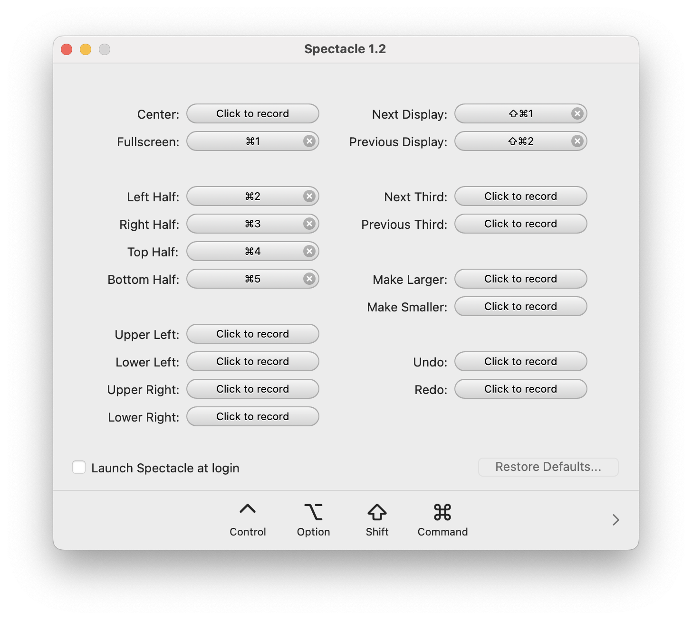

세팅할 때마다 바뀌는 것들이 많다.  
2025년 새해를 맞아 세팅 과정을 기록했다. 사양은 다음과 같다.

- Apple Silicon 탑재(M시리즈 칩)
- macOS Sequoia v15.2

<br>

# 기본 설정

## 데스크탑 및 Dock


설정을 바꾸기에 앞서 Dock에서 불필요한 바로가기는 모두 제거하는 편이다. Finder와 휴지통만 남겨둘 때도 있는데 보통 바로가기의 수는 다섯 가지 이내로 유지한다. 나머지는 이어서 소개하는 Raycast로 다루는 것을 좋아한다.


`설정` - `데스크탑 및 Dock` 순서로 설정 메뉴에 진입할 수 있다. 대부분 개인 취향에 따라 조정하면 된다.

- **윈도우 제목 막대 두 번 클릭**: 최소화
- **자동으로 가리기와 보기**: 활성화
- **열려있는 응용 프로그램에 대한 표시 보기**: 비활성화
- **Dock에서 제안된 앱 및 최근 앱 보기**: 비활성화
- **스테이지 매니저 비활성화**: 비활성화
- **배경화면을 클릭하여 데스크탑 표시**: 스테이지 매니저에서만(=비활성화)

## 키보드 및 입력

맥에서는 한영키를 전환할 때 발생하는 딜레이 때문에 타이핑 중 오타가 발생하는 경우가 많다. 그래서 Karabiner를 설치하고 아래 링크를 참고하여 입력 소스에 대한 설정을 한다.

참고: https://itbluebook.tistory.com/3

요약하자면 다음과 같다.

- `Caps Lock`를 통한 한영 전환 기본 기능 비활성화
- Karabiner 설치 후 `Caps Lock`을 사용하지 않는 키로 매핑(나는 `f17`)
- 입력 메뉴에서 다음 소스 선택 단축키 `f17`로 변경

그리고 `Command`와 `Ctrl`을 바꾸고 싶다면, `키보드` - `키보드 단축키` - `보조키` 순서로 메뉴에 진입하여 다음과 같이 설정하면 된다. 키보드 선택에서 Karabiner 드라이버를 선택헤야 한다. (이렇게 하지 않고 Karabiner에서 직접 바꿔도 됨)


## 트랙패드


`설정` - `트랙패드` 순서로 진입하여 아래 옵션을 수정한다.

- **트랙패드 탭하여 클릭하기 옵션**: 활성화
- **추가 제스처** - **페이지 쓸어넘기기**: 세 손가락으로
  - 두 손가락으로 하는 경우 가로 스크롤 이동과 겹쳐서 잘 안될 때가 있음

## 스크린샷을 바로 클립보드에 저장


스크린샷을 바로 클립보드에 저장해서 활용하고 싶다면 `Cmd` + `Ctrl` + `5`로 스크린샷 모드를 활성화시킨 후 옵션에서 `다음으로 저장` - `클립보드`를 선택한다.

<br>

# 필수 앱 설치

## 브라우저


개인적으로 [Arc](https://arc.net/)를 선호하는 편이지만, 개발할 때 필요할 때가 있기 때문에 크롬을 먼저 설치한다. 일부 디버깅이나 시뮬레이션 도구가 크롬을 필요로 하는 것만으로도 크롬 설치를 피하기는 어렵다.

Arc도 설치한다. Arc는 단축키 매핑이 편리하고 Space를 나누어 작업하기에도 좋다. 크롬에서 프로필을 나누는 것처럼 스페이스마다 구글 계정을 다르게 설정하기도 하고 단순히 작업 공간을 나눠 사용하다가 지워버리기 좋다. 스페이스간 이동은 `Ctrl`과 좌우 방향키 조합으로 세팅한다.

단 작년에 본 자료에 따르면, Arc에 더 이상의 신규 기능은 없을 예정이라고 한다.

출처: https://yozm.wishket.com/magazine/detail/2844/

## Raycast

적어도 내게 있어서 [Raycast](https://www.raycast.com/)는 필수다. Raycast를 설치하고 맥의 Spotlight를 대체할 수 있도록 단축키를 변경한다.

- `설정` - `키보드 단축키` - `키보드` - `Spotlight` - `단축키 설정 해제`
- Raycast 트리거 단축키 `Cmd` + `Space`로 변경

Raycast는 주로 다음과 같은 이유로 사용한다.

- 자주 사용하는 앱을 실행할 때
- 자주 사용하는 앱의 즐겨찾기 또는 단축키 설정
- 클립보드 히스토리 확인 및 복사
- 계산기
- Raindrop을 사용한 북마크 등록 및 탐색
- 이미 설정해 둔 단축어의 shortcut 설정

## Spectacle

[Spectacle](https://spectacle.softonic.kr/mac)은 단축키 입력으로 윈도우를 다양하게 배치하는 기능을 제공한다. 유사한 기능을 제공하는 앱도 많고 일부는 유료 서비스다. 먼저 언급한 Raycast도 기본으로 제공하고 최근 Sequoia에서 편의 기능이 업데이트 되기도 했지만, Spectacle이 설정, 관리, 사용 모든 측면에서 좋아서 여전히 사용하고 있다. 내 설정은 다음과 같다.



## AltTab

[AltTab](https://alt-tab-macos.netlify.app/)은 이름 그대로 `Alt` + `Tab`을 이용한 윈도우 스위칭 기능을 제공한다. 맥에서는 커맨드 키로 윈도우를 스위칭해야 하기 때문에 Windows에서의 경험을 원하는 사람들이 많이 사용하는 것 같다. 하지만 이 앱을 알기 전에 이미 `Cmd` + `Tab`에 익숙해져서 개인적으로는 `Cmd` + `Tab` 조합으로 매핑하고 맵의 기본 동작을 대체하여 사용하고 있다. AltTab을 사용하는 가장 큰 이유는 **블랙리스트** 기능을 제공하기 때문이다. 작업을 하다보면 목록에 걸리지 않았으면 하는 앱이 존재하기 마련이다. 나의 경우에는 완전히 닫을 수도 없는 Finder가 그러하고 카카오톡 앱도 목록에서 보이지 않도록 설정한다.


# 터미널 설정

가능하면 공식문서를 참고하는 것이 좋다.

## iTerm2 설치

[공식 문서 참고](https://iterm2.com/)

## iTerm 설정

개인 설정 불러오기

https://github.com/rheech22/dotfiles/blob/master/iterm_latest.json

## Homebrew 설치

[공식 문서 참고](https://brew.sh/ko/)

## NerdFont 설치

터미널에서 폰트, 특히 아이콘이 깨지지 않도록 적절한 폰트를 설치한다. 나는 Meslo 폰트를 사용하고 있다.

```bash
brew install --cask font-meslo-lg-nerd-font
```

폰트 설치 후 iTerm 세팅에 적용해주기


## Z Shell 설치

```bash
brew install zsh
```

## 기본 쉘 설정

```bash
chsh -s $(which zsh)
```

## Oh My Zsh 설치

[공식 문서 참고](https://ohmyz.sh/)

## zsh-syntax-highligting 설치

```bash
brew install zsh-syntax-highlighting
```

`~/.zsrhrc`에서 아래 내용 추가 후 재시작

```bash
# .zshrc

source $(brew --prefix)/share/zsh-syntax-highlighting/zsh-syntax-highlighting.zsh

```

## vi cli mode를 위한 zsh-vi-mode 설치

```bash
brew install zsh-vi-mode
```

`~/.zsrhrc`에서 아래 내용 추가 후 재시작

```bash
# .zshrc

source $(brew --prefix)/opt/zsh-vi-mode/share/zsh-vi-mode/zsh-vi-mode.plugin.zsh

```

## 터미널 꾸미기

```bash
brew install starship
```

`~/.zsrhrc`에서 아래 내용 추가 후 재시작

```bash
# .zshrc
eval "$(starship init zsh)"

```

[프리셋](https://starship.rs/presets/) 참고하여 설정하기

https://starship.rs/presets/

# 기타

## neovim 설치

vim 설정은 나중에 따로 정리하려고 한다.

```bash
brew install neovim
```

## Node.js 설치

```bash
brew install node
```

## Python 설치

```bash
brew install python
```
