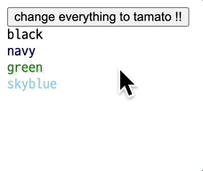
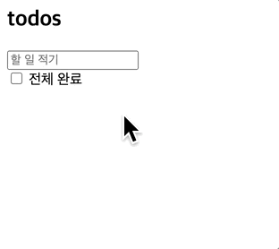
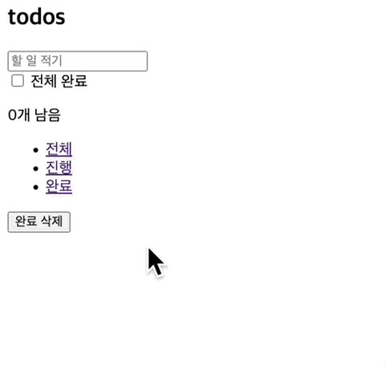

## 웹 컴포넌트

웹 컴포넌트는 세 가지 주요 내용을 포함한다.

- HTML 템플릿: 마크업에 포함된 템플릿 요소를 화면에 그리진 않는다. 대신 자바스크립트가 템플릿을 사용해서 DOM을 동적으로 생성할 수 있다.
- Shadow DOM: Shadow DOM의 핵심은 캡슐화로 메인 DOM 트리로부터 독립적인 DOM을 생성할 수 있다. `<input />`, `<video />`와 같은 기본 요소에도 Shadow DOM이 숨겨져 있다.
- Custom Elelment: 사용자 정의 요소를 만들고 제어할 수 있는 API로 이 챕터에서 주로 다룰 주제이다.

## 사용자 정의 요소(Custom Element)

먼저 간단한 사용자 정의 요소를 만들어 보자.

```html
<color-box></color-box>
```

주의 사항

- 이름에는 반드시 하이픈(-)이 들어가야 한다.
- 태그를 잘 닫아주어야 한다.

어떻게 사용할까? HTML에 사용자 정의 요소를 추가한다.

```html{8-11}
<html>
    <head>
        <link rel="shortcut icon" href="../favicon.ico" />
        <title>Frameworkless Frontend Development</title>
    </head>
    <body>
       <button>change everything to tamato !!</button>
       <color-box></color-box>
       <color-box color="navy"></color-box>
       <color-box color="green"></color-box>
       <color-box color="skyblue"></color-box>
       <script type="module" src="index.js"></script>
    </body>
</html>
```

사용자 정의 요소도 DOM 요소이기 때문에 `HTMLElement`를 상속한다.

```js
// Color.js
export default class Color extends HTMLElement {
  // ... 
}
```

`customElements.define()`는 [CustomElementRegistry](https://developer.mozilla.org/ko/docs/Web/API/CustomElementRegistry)에 새로운 사용자 정의 요소를 등록한다.

```js
// index.js
import Color from './components/Color.js';

customElements.define('color-box', Color);
```

사용자 정의 요소는 여러 생명주기 함수를 갖는다.

- `connectedCallback`: 처음으로 DOM에 연결됐을 때 호출
- `disconnectedCallback`: DOM으로부터 연결이 해제될 때 호출
- `adoptedCallback`: 새로운 다큐먼트로 이동될 때 호출
- `attributeChangedCallback`: 특정 속성이 변경될 때 호출

`attributeChangedCallback()`로 사용자 정의 요소의 `color` 속성이 변경될 때 자식 요소의 속성을 변경할 계획이다. 이 메서드는 `observedAttributes()`가 관찰하는 속성이 변경될 때만 호출된다.

```js
// Color.js

const DEFAULT_COLOR = 'black';

export default class Color extends HTMLElement {
  static get observedAttributes() {
    return ['color']
  }

  get color() {
    return this.getAttribute('color') || DEFAULT_COLOR
  }

  set color(value) {
    this.setAttribute('color', value)
  }

  attributeChangedCallback(name, prevState, state) {
    if (!this.div) return;

    if (name === 'color') {
      this.div.style.color = state
      this.div.textContent = state
    }
  }

  connectedCallback() {
    window.requestAnimationFrame(() => {
      this.div = document.createElement('div');

      this.div.textContent = this.color;
      this.div.style.color = this.color;

      this.appendChild(this.div);
    })
  }
}
```

버튼 요소에 모든 요소를 `tomato` 색으로 바꿔주는 이벤트 핸들러를 연결한다.

```js{7-9}
// index.js

import Color from './components/color.js';

customElements.define('color-box', Color);

const changeToTomato = () => document.querySelectorAll('color-box').forEach(div => div.color = 'tomato');

document.querySelector('button').addEventListener('click', changeToTomato);
```

순서는 아래와 같다.

1. 버튼 클릭 이벤트 발생
2. 핸들러는 해당 요소의 `color` 속성 변경
3. `observedAttributes()`는 속성 변경 감지
4. `attributeChangedCallback()` 호출
5. `color` 속성에 따라 자식 요소의 스타일, 텍스트 변경

<br />

음.. 잘 된다.



## 사용자 정의 요소로 구현한 투두 앱

지난 챕터에서 만들었던 투두 앱을 사용자 정의 요소를 사용한 앱으로 변경한다.  


### 사용자 정의 요소 등록

HTML에 아래 사용자 정의 요소를 추가한다.

- `<custom-app />`
- `<custom-todos />`

기존 루트 요소는 `<custom-app />`요소가 대체한다.

```html{35, 39}
<html>
  <head>
    <title>todos</title>
  </head>
  <body>
    <template id="todo-footer">
      <footer class="footer">
        <span class="counter"></span>
        <ul class="filters">
          <li><a href="#/">전체</a></li>
          <li><a href="#/active">진행</a></li>
          <li><a href="#/completed">완료</a></li>
        </ul>
        <button class="clear-completed">완료 삭제</button>
      </footer>
    </template>
    <template id="todo-item">
      <li>
        <div class="view">
          <input class="toggle" type="checkbox">
          <label></label>
          <button class="destroy">삭제</button>
        </div>
      </li> 
    </template>
    <template id="todo-app">
      <section class="todoapp">
        <header>
          <h1>todos</h1>
          <input class="new-todo" placeholder="할 일 적기" autofocus>
        </header>
        <section class="main">
          <input id="toggle-all" class="toggle-all" type="checkbox">
          <label for="toggle-all">전체 완료</label>
          <custom-todos></custom-todos>
        </section>
      </section>
    </template>
    <custom-app></custom-app>
    <script type="module" src="index.js"></script>
  </body>
</html>
```

컨트롤러는 레지스트리에 사용자 정의 요소를 등록한다.

```js{6-7}
// index.js

import App from './components/App.js'
import Todos from './components/Todos.js'

window.customElements.define('custom-app', App);
window.customElements.define('custom-todos', Todos);
```

### DOM에 연결될 때 하는 일

돔에 연결될 때 필요한 것들을 `connectedCallback()`에 적어보자. `<custom-todos />`는 어떤 모양일까?  
우선 각 할 일을 담을 목록이 필요하다. `<ul />`을 간단한 템플릿으로 사용한다.

```js
export default class Todos extends HTMLElement {
  connectedCallback() {
    this.innerHTML = '<ul class="todo-list"></ul>';
  }
}
```

각 할 일 요소를 위한 구성은 이미 HMTL의 템플릿 요소로 있기 때문에 가져오기만 하면 된다.

```js{4}
export default class Todos extends HTMLElement {
  connectedCallback() {
    this.innerHTML = '<ul class="todo-list"></ul>';
    this.item = document.getElementById('todo-item');
  }
}
```

이벤트 핸들러도 연결한다. 이벤트 위임 방식으로 목록에 이벤트 핸들러를 할당한다.

```js{6-18}
export default class Todos extends HTMLElement {
  connectedCallback() {
    this.innerHTML = '<ul class="todo-list"></ul>';
    this.item = document.getElementById('todo-item');
  
    this.list = this.querySelector('ul');
  
    this.list.addEventListener('click', (e) => {
        if (e.target.matches('button.destroy')) {
          this.onDeleteButtonClick(e.target.dataset.index);
        }
    });
  
    this.list.addEventListener('change', (e) => {
        if (e.target.matches('input.toggle')) {
          this.onCheckboxClick(e.target.dataset.index);
        }
    })
  }
}
```

마지막으로 상태에 따라 목록을 생성하고 갱신하는 `update()`를 호출한다.

```js{5}
export default class Todos extends HTMLElement {
  connectedCallback() {
    // ...상동

    this.update();
  }
}
```

`update()`는 새로운 목록을 채워주는 지난 챕터의 Todos 컴포넌트가 하던 역할을 그대로 하고 있다.  
```js
export default class Todos extends HTMLElement {
  connectedCallback() {
    // ...
  }

  update() {
    this.list.innerHTML = '';

    this.todos.map((todo, index) => {
      const { text, completed } = todo;

      const element = this.item.content.firstElementChild.cloneNode(true);

      element.querySelector('label').textContent = text;

      if (completed) {
        element.classList.add('completed');
        element.querySelector('input.toggle').checked = true;
      }

      element.querySelector('input.toggle').dataset.index = index;
      element.querySelector('button.destroy').dataset.index = index;

      return element
    }).forEach((element) => {
      this.list.appendChild(element)
    })
  }
}
```

`update()`는 `this.todos`에 접근한다. 이 속성(property)은 사용자 정의 요소의 속성(attribute)으로도 할당되는 특징이 있다. 이 곳에 할 일 목록을 저장한다.

```html
<custom-todos todos="[]"> ... <custom-todos />
```

`todos`접근을 위한 게터와 세터를 생성한다.

```js{10-20}
export default class Todos extends HTMLElement {
  connectedCallback() {
    // ...
  }

  update() {
    // ...
  }

  get todos() {
    if (!this.hasAttribute('todos')) {
      return [];
    }

    return JSON.parse(this.getAttribute('todos'));
  }

  set todos(value) {
    this.setAttribute('todos', JSON.stringify(value));
  }
}
```

### 관찰 대상이 갱신되면 하는 일

속성이 바뀔 때마다 새로운 할 일 요소를 동적으로 생성하기 위해  `attributeChangedCallback()`을 사용한다. `update()`를 실행하는 이 함수는 `observedAttributes()`가 관찰하는 `todos`속성이 바뀔 때만 호출된다.

```js
export default class Todos extends HTMLElement {
  static get observedAttributes() {
    return ['todos'];
  }

  attributeChangedCallback() {
    if (!this.hasChildNodes()) return;

    this.update();
  }

  // 생략
}
```

### 커스텀 이벤트는 옵저버 패턴의 구현?!

마지막으로 이벤트 핸들러를 선언한다. 이 곳에서는 이벤트가 발생하는 사실만을 알려주고 그 때 처리해야 하는 일은 다른 곳에서 결정하도록 하고 싶다면 어떻게 해야 할까? 커스텀 이벤트를 활용한 방법이 있다. 그 전에 먼저 이벤트 레지스트리를 등록한다. 구독하는 곳에서도 쉽게 접근할 수 있도록 컨트롤러에 선언한다.

```js{6-9}
// index.js

import App from './components/App.js'
import Todos from './components/Todos.js'

export const events = {
  deleteItem: 'deleteItem',
  toggleCompleted: 'toggleCompleted',
}

window.customElements.define('custom-app', App);
window.customElements.define('custom-todos', Todos);
```

이벤트 핸들러는 아래와 같다. 단순히 인덱스를 포함하는 커스텀 이벤트 객체를 생성하고 이벤트를 디스패치한다. 

```js{20-41}
import { events } from "../index.js";

export default class Todos extends HTMLElement {
  connectedCallback() {
    // ...
  }

  update() {
    // ...
  }

  get todos() { 
    // ... 
  }

  set todos(value) { 
    // ...
  }

  onDeleteButtonClick(index) {
    const event = new CustomEvent(
      events.deleteItem,
      {
        detail: {
          index
        }
      }
    )

    this.dispatchEvent(event)
  }

  onCheckboxClick(index) {
    const event = new CustomEvent(
      events.toggleCompleted,
      {
        detail: {
          index
        }
      }
    )

    this.dispatchEvent(event)
  }
}
```

이 곳에서는 이벤트 발생에 따라 ‘어떤 일을 해야 할지’에 관해 관심을 두지 않아도 된다. 한편 외부에서는 ‘이벤트가 발생하는 경로’에 관한 사실을 몰라도 된다. 자연스럽게 관심사를 분리하고 각자의 역할을 수행한다. 경우에 따라서 중복 코드도 줄일 수 있다. 사실 커스텀 이벤트를 처음 접할 때 그 효용에 관해서 의심을 가졌는데, 챕터의 예제를 보고 괜히 나온 API가 아니라는 느낌을 받았다. 커스텀 이벤트가 옵저버 패턴의 구현체라고 소개하는 글을 보기도 했다. 관심있으면 아래 링크를 참고하자.

[How are custom events in JavaScript different from simply calling regular functions?](https://stackoverflow.com/questions/57036994/how-are-custom-events-in-javascript-different-from-simply-calling-regular-functi)

앱 전체를 구성하는 `<custom-app />`은 상태를 선언하고 todo-app 템플릿을 사용한다. 책에서는 `constructor()`에서 미리 상태와 템플릿을 선언하고 있지만, DOM에 처음 연결될 때 초기화해도 무리가 없을 것 같아 `connectedCallback()`이 그 책임을 갖도록 했다.

```js
export default class App extends HTMLElement {
  connectedCallback() {
    this.state = {
      todos: [],
      filter: 'All'
    }

    this.template = document.getElementById('todo-app');
  }
}
```

렌더링도 해야 한다. 특별한 내용이 있다면 세 개의 이벤트 중 두 개는 레지스트리에 등록된 커스텀 이벤트라는 사실이다.

```js{10-28}
export default class App extends HTMLElement {
  connectedCallback() {
    this.state = {
      todos: [],
      filter: 'All'
    }

    this.template = document.getElementById('todo-app');

    window.requestAnimationFrame(() => {
      const content = this.template.content.firstElementChild.cloneNode(true);

      this.appendChild(content);

      this.querySelector('.new-todo').addEventListener('keypress', (e) => {
        if (e.key === 'Enter') {
          this.addItem(e.target.value);

          e.target.value = '';
        }
      })

      this.list = this.querySelector('custom-todos');
      this.list.addEventListener(events.deleteItem, (e) => this.deleteItem(e.detail.index));
      this.list.addEventListener(events.toggleCompleted, (e) => this.toggleCompleted(e.detail.index));

      this.sync();
    })
  }
}
```

이벤트가 발생하면 어떤 일을 할지 이곳에서 정한다.

```js{6-30}
export default class App extends HTMLElement {
  connectedCallback() {
    // ...
  }

  addItem(text) {
    const item = { text, completed: false };

    this.state.todos.push(item);

    this.sync();
  }

  deleteItem(index) {
    this.state.todos.splice(index, 1);

    this.sync();
  }

  toggleCompleted(index) {
    const { todos } = this.state;

    todos.splice(index, 1, {
      text: todos[index].text,
      completed: !todos[index].completed
    });

    this.state.todos = todos;
    this.sync();
  }
}
```

모든 메서드에서 호출하고 있는 `sync()`는 상태에 따라 `<custom-todos />`의 속성을 갱신한다.

```js{6-10}
export default class App extends HTMLElement {
  connectedCallback() {
    // ...
  }

  sync() {
    const { todos } = this.state;

    this.list.todos = todos;
  }

  addItem(text) {
    // ...
  }

  deleteItem(index) {
    // ...
  }

  toggleCompleted(index) {
    // ...
  }
}
```

### 검증하기

이제 할 일 추가, 삭제, 체크 그리고 체크의 해제 모두 잘 동작한다.



유사한 내용이라 자세히 다루진 않겠지만 todo-footer 템플릿을 사용하는 `<custom-footer />`도 추가했다.

```js{8-9, 14}
import App from './components/App.js'
import Footer from './components/Footer.js';
import Todos from './components/Todos.js'

export const events = {
  deleteItem: 'deleteItem',
  toggleCompleted: 'toggleCompleted',
  filterItem: 'filterItem',
  clearCompleted: 'clearCompleted'
}

window.customElements.define('custom-app', App);
window.customElements.define('custom-todos', Todos);
window.customElements.define('custom-footer', Footer);
```

이제 필터도 동작한다.



## 관련 라이브러리

[MDN](https://developer.mozilla.org/en-US/docs/Web/Web_Components/Using_custom_elements)에서 웹 컴포넌트의 추상화 레벨을 높인 여러 라이브러리를 소개하고 있는데 관심있다면 한 번 둘러보는 것을 추천한다. 나는 [snuggsi](https://github.com/devpunks/snuggsi)의 맛만 살짝 봤는데 괜찮은 경험이었다.

- [FASTElement](https://www.fast.design/docs/fast-element/getting-started/)
- [snuggsi](https://github.com/devpunks/snuggsi)
- [X-Tag](https://x-tag.github.io/)
- [Slim.js](https://slimjs.com/)
- [Lit](https://lit.dev/)
- [Smart](https://www.htmlelements.com/)
- [Stencil](https://stenciljs.com/)
- [hyperHTML-Element](https://github.com/WebReflection/hyperHTML-Element)
- [DataFormsJS](https://www.dataformsjs.com/)
- [Custom-Element-Builder](https://tmorin.github.io/ceb/).

## 출처
_프란세스코 스트라츨로, [『프레임워크 없는 프론트엔드 개발』](https://search.shopping.naver.com/book/search?bookTabType=ALL&pageIndex=1&pageSize=40&query=%ED%94%84%EB%A0%88%EC%9E%84%EC%9B%8C%ED%81%AC%20%EC%97%86%EB%8A%94%20%ED%94%84%EB%A1%A0%ED%8A%B8%EC%97%94%EB%93%9C%20%EA%B0%9C%EB%B0%9C&sort=REL), 에이콘 출판(2021.01.21.)_
